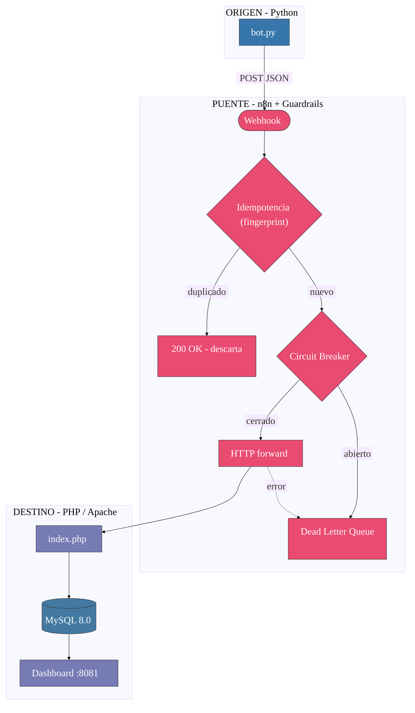
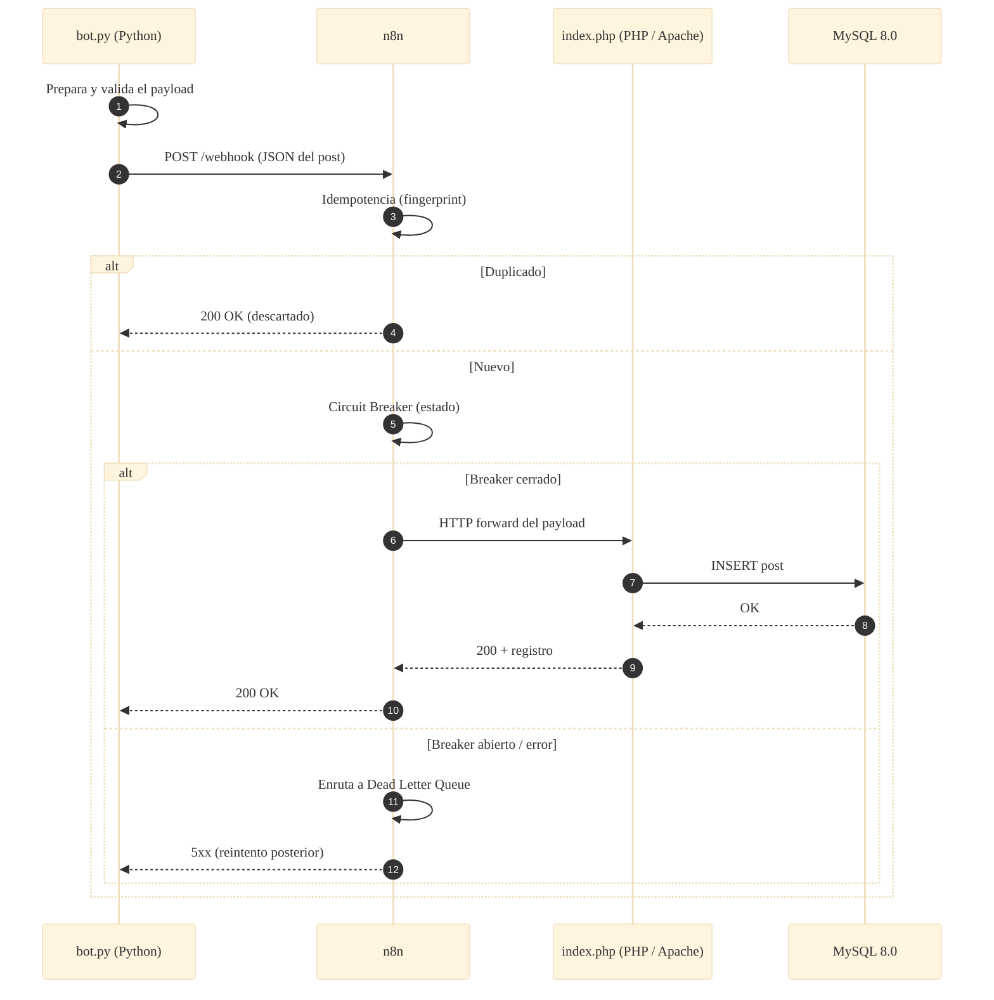

# 📐 Arquitectura — Caso 01: 🐍 Python → 🌉 n8n → 🐘 PHP

[](https://www.python.org/)
[](https://www.php.net/)
[](https://www.mysql.com/)
[](https://n8n.io/)

> Emisor de automatización en **Python + Pydantic** que publica hacia un receptor web clásico en **PHP/Apache**, orquestado por **n8n** con guardrails de resiliencia (idempotencia, circuit breaker, DLQ) y persistencia en **MySQL**.

---

## 🧭 Ficha técnica

| Atributo | Valor |
| :--- | :--- |
| **ID** | `01` |
| **Origen** | Python 3.11 + Pydantic — [`origin/bot.py`](origin/bot.py) |
| **Puente** | n8n — [`case-01-python-to-php.json`](../../n8n/workflows/case-01-python-to-php.json) |
| **Destino** | PHP 8.2 sobre Apache 2.4 — [`dest/index.php`](dest/index.php) |
| **Persistencia** | MySQL 8.0 |
| **Puerto (dashboard)** | [`http://localhost:8081`](http://localhost:8081) |
| **Perfil Docker** | `case01` |
| **Guardrails** | Idempotencia · Circuit Breaker · Dead Letter Queue |

---

## 🗺️ Diagrama de arquitectura



---

## 🔁 Diagrama de secuencia (ciclo de una publicación)



---

## 🧩 Componentes

### 🐍 Origen — Python Bot

- Lee `posts.json`, **valida la estructura con Pydantic** y dispara hacia el webhook de n8n.
- Resiliencia en el envío (manejo de errores + logs locales de ejecución).

### 🌉 Puente — n8n

- Recibe el webhook, aplica **idempotencia** (descarta duplicados por fingerprint), pasa por el **Circuit Breaker** y reenvía al destino. Los fallos se enrutan a la **Dead Letter Queue**.

### 🐘 Destino — PHP / Apache

- `index.php` recibe el payload, lo persiste en **MySQL** y lo sirve en un dashboard web (`:8081`). Apache aplica los security headers del laboratorio (`Options -Indexes`, CSP, X-Frame-Options, etc.).

---

## ▶️ Cómo levantarlo

```bash
docker-compose --profile case01 up -d      # levanta receptor PHP + MySQL + n8n
python hub.py ejecutar 01-python-to-php     # dispara el emisor Python
```

Dashboard: [`http://localhost:8081`](http://localhost:8081)

---

## 🔗 Enlaces

- 📄 [README del caso](README.md)
- 🗺️ [Arquitectura global del laboratorio](../../docs/ARCHITECTURE.md)
- 🛡️ [Guardrails de resiliencia](../../docs/GUARDRAILS.md)
- 🧩 [Índice de casos](../../docs/CASES_INDEX.md)

---

*Diagramas en [Mermaid](https://mermaid.js.org/) — se renderizan nativamente en GitHub. Parte de **Social Bot Scheduler**.*
