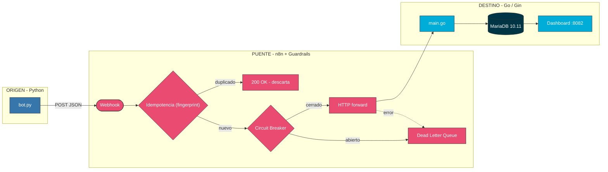
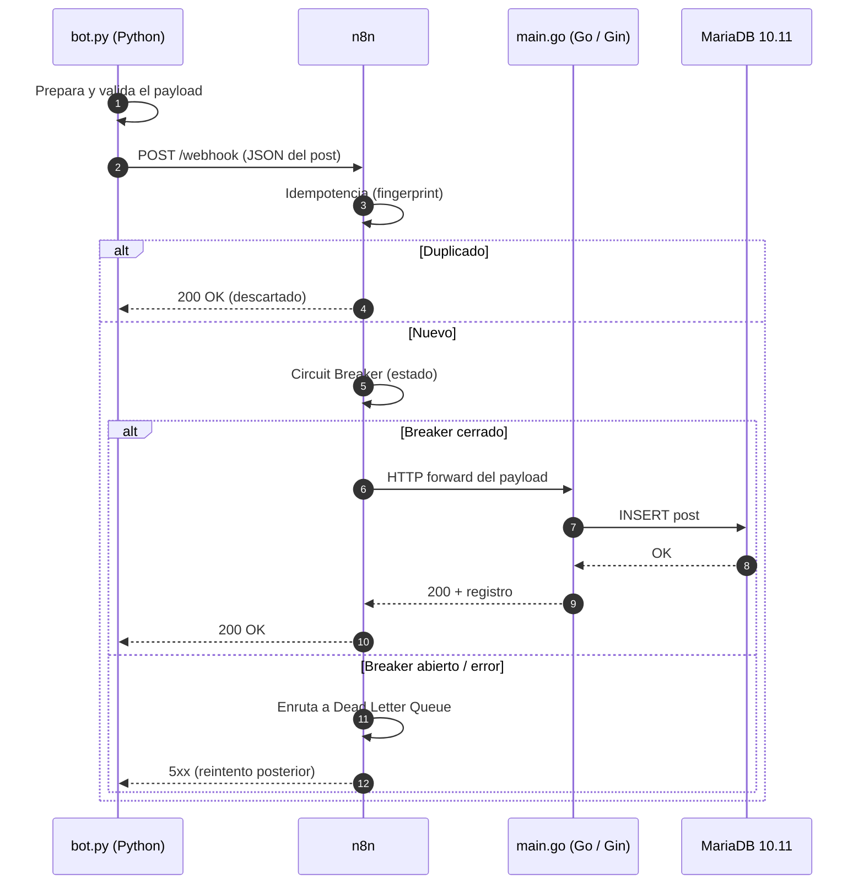

# 📐 Arquitectura — Caso 02: 🐍 Python → 🌉 n8n → 🐹 Go

[](https://www.python.org/)
[](https://go.dev/)
[](https://mariadb.org/)
[](https://n8n.io/)

> Emisor de automatización en **Python + Pydantic** que publica hacia un receptor compilado de alto rendimiento en **Go (Gin)**, orquestado por **n8n** con guardrails de resiliencia (idempotencia, circuit breaker, DLQ) y persistencia en **MariaDB**.

---

## 🧭 Ficha técnica

| Atributo | Valor |
| :--- | :--- |
| **ID** | `02` |
| **Origen** | Python 3.11 + Pydantic — [`origin/bot.py`](origin/bot.py) |
| **Puente** | n8n — [`case-02-python-to-go.json`](../../n8n/workflows/case-02-python-to-go.json) |
| **Destino** | Go 1.21 con framework Gin — [`dest/main.go`](dest/main.go) |
| **Persistencia** | MariaDB 10.11 |
| **Puerto (dashboard)** | [`http://localhost:8082`](http://localhost:8082) |
| **Perfil Docker** | `case02` |
| **Guardrails** | Idempotencia · Circuit Breaker · Dead Letter Queue |

---

## 🗺️ Diagrama de arquitectura



---

## 🔁 Diagrama de secuencia (ciclo de una publicación)



---

## 🧩 Componentes

### 🐍 Origen — Python Event Bus

- Carga `posts.json`, **valida cada entrada con Pydantic** antes del envío y despacha publicaciones programadas hacia el webhook de n8n dirigido específicamente al flujo de receptores Go.
- Resiliencia en el envío (manejo de errores + logs locales de ejecución).

### 🌉 Puente — n8n

- Recibe el webhook, aplica **idempotencia** (descarta duplicados por fingerprint), pasa por el **Circuit Breaker** y reenvía al destino. Ante fallos de red o saturación del servicio Go aplica **reintentos automáticos** (hasta 3 intentos) y los fallos persistentes se enrutan a la **Dead Letter Queue** con el payload original.

### 🐹 Destino — Go / Gin

- `main.go` es un receptor compilado de alto rendimiento y mínima huella de memoria, servido con el framework **Gin**. Implementa `sync.Mutex` para garantizar la integridad en escrituras concurrentes y persiste el payload en **MariaDB**, sirviéndolo en un dashboard web (`:8082`). Diseñado para procesar ráfagas de eventos con baja latencia y sin degradación del servicio.

---

## ▶️ Cómo levantarlo

```bash
docker-compose --profile case02 up -d      # levanta receptor Go + MariaDB + n8n
python hub.py ejecutar 02-python-to-go      # dispara el emisor Python
```

Dashboard: [`http://localhost:8082`](http://localhost:8082)

---

## 🔗 Enlaces

- 📄 [README del caso](README.md)
- 🗺️ [Arquitectura global del laboratorio](../../docs/ARCHITECTURE.md)
- 🛡️ [Guardrails de resiliencia](../../docs/GUARDRAILS.md)
- 🧩 [Índice de casos](../../docs/CASES_INDEX.md)

---

*Diagramas en [Mermaid](https://mermaid.js.org/) — se renderizan nativamente en GitHub. Parte de **Social Bot Scheduler**.*
