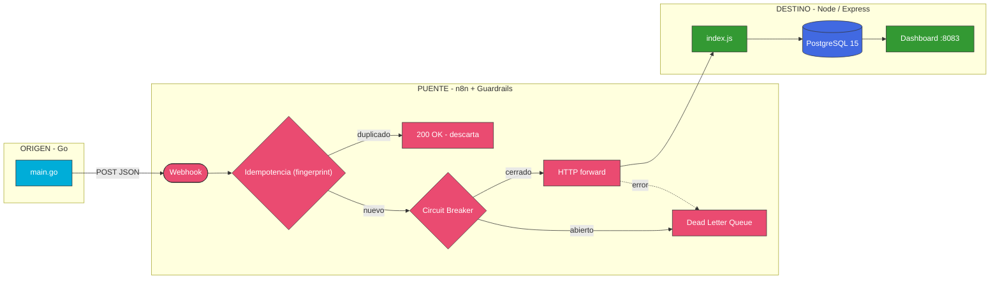
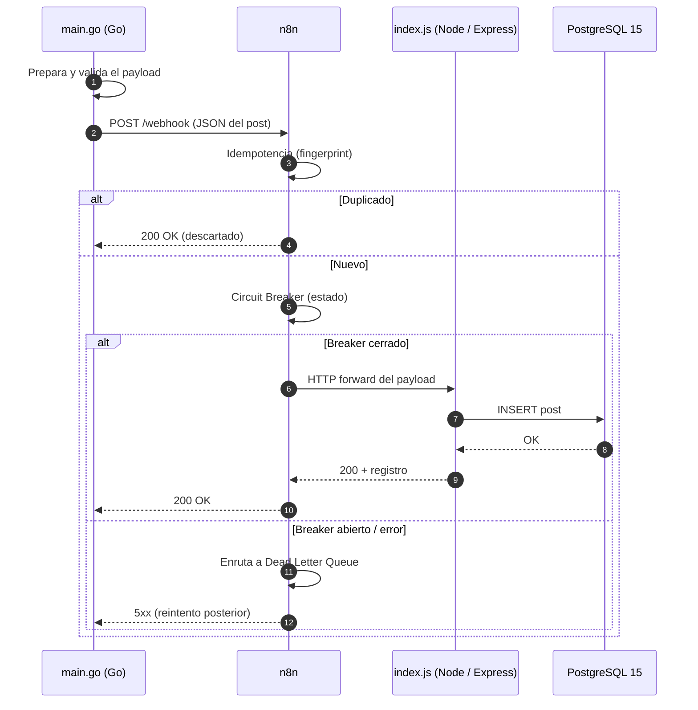

# 📐 Arquitectura — Caso 03: 🐹 Go → 🌉 n8n → 🟢 Node.js

[](https://go.dev/)
[](https://nodejs.org/)
[](https://www.postgresql.org/)
[](https://n8n.io/)

> Emisor concurrente compilado en **Go** que publica hacia un receptor flexible y asíncrono en **Node.js (Express)**, orquestado por **n8n** con guardrails de resiliencia (idempotencia, circuit breaker, DLQ) y persistencia en **PostgreSQL**.

---

## 🧭 Ficha técnica

| Atributo | Valor |
| :--- | :--- |
| **ID** | `03` |
| **Origen** | Go 1.21 — [`origin/main.go`](origin/main.go) |
| **Puente** | n8n — [`case-03-go-to-node.json`](../../n8n/workflows/case-03-go-to-node.json) |
| **Destino** | Node.js 20 con Express — [`dest/index.js`](dest/index.js) |
| **Persistencia** | PostgreSQL 15 |
| **Puerto (dashboard)** | [`http://localhost:8083`](http://localhost:8083) |
| **Perfil Docker** | `case03` |
| **Guardrails** | Idempotencia · Circuit Breaker · Dead Letter Queue |

---

## 🗺️ Diagrama de arquitectura



---

## 🔁 Diagrama de secuencia (ciclo de una publicación)



---

## 🧩 Componentes

### 🐹 Origen — Go Concurrent Scheduler

- Emisor de alta concurrencia que utiliza **goroutines** para el escaneo de `posts.json` y el despacho inmediato hacia el webhook de n8n.
- Emplea el cliente HTTP nativo de Go, sin dependencias externas pesadas, maximizando eficiencia y velocidad.

### 🌉 Puente — n8n

- Recibe el webhook, aplica **idempotencia** (descarta duplicados por fingerprint), pasa por el **Circuit Breaker** y reenvía al destino. Aplica una política de **3 reintentos** con intervalo de 1s ante fallos; los eventos que fallan tras los reintentos se enrutan a la **Dead Letter Queue** (tabla de auditoría) para recuperación manual.

### 🟢 Destino — Node.js / Express

- `index.js` es un receptor basado en **Express** con optimización de JSON parsing que **valida rigurosamente el schema del payload** antes de la inserción. Persiste los datos de forma relacional avanzada en **PostgreSQL** y los sirve en un dashboard dinámico (`:8083`) con recarga automática de datos.

---

## ▶️ Cómo levantarlo

```bash
docker-compose --profile case03 up -d      # levanta receptor Node.js + PostgreSQL + n8n
python hub.py ejecutar 03-go-to-node        # dispara el emisor Go
```

Dashboard: [`http://localhost:8083`](http://localhost:8083)

---

## 🔗 Enlaces

- 📄 [README del caso](README.md)
- 🗺️ [Arquitectura global del laboratorio](../../docs/ARCHITECTURE.md)
- 🛡️ [Guardrails de resiliencia](../../docs/GUARDRAILS.md)
- 🧩 [Índice de casos](../../docs/CASES_INDEX.md)

---

*Diagramas en [Mermaid](https://mermaid.js.org/) — se renderizan nativamente en GitHub. Parte de **Social Bot Scheduler**.*
