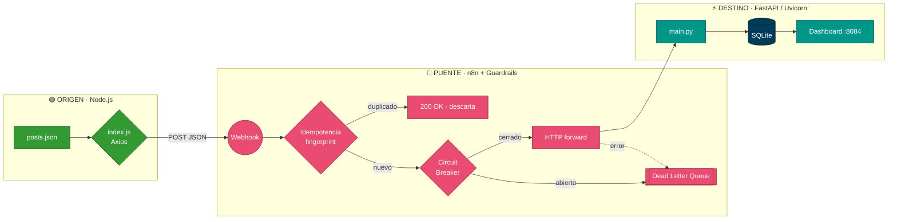
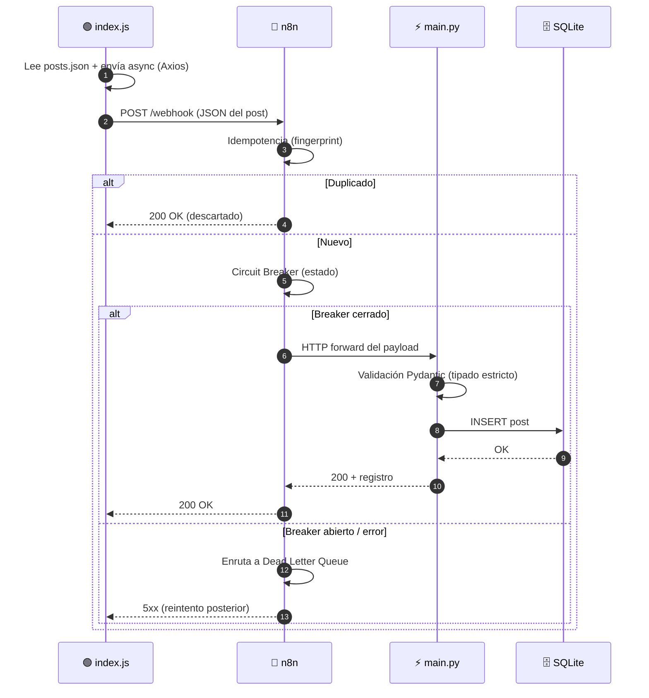

# 📐 Arquitectura — Caso 04: 🟢 Node.js → 🌉 n8n → ⚡ FastAPI

[](https://nodejs.org/)
[](https://fastapi.tiangolo.com/)
[](https://www.sqlite.org/)
[](https://n8n.io/)

> Emisor de automatización en **Node.js asíncrono (Axios)** que publica hacia un receptor de alto rendimiento en **FastAPI/Uvicorn**, orquestado por **n8n** con guardrails de resiliencia (idempotencia, circuit breaker, DLQ) y persistencia embebida en **SQLite**.

---

## 🧭 Ficha técnica

| Atributo | Valor |
| :--- | :--- |
| **ID** | `04` |
| **Origen** | Node.js 20 + Axios — [`origin/index.js`](origin/index.js) |
| **Puente** | n8n — [`case-04-node-to-fastapi.json`](../../n8n/workflows/case-04-node-to-fastapi.json) |
| **Destino** | FastAPI + Uvicorn (Python) — [`dest/main.py`](dest/main.py) |
| **Persistencia** | SQLite (embebido) |
| **Puerto (dashboard)** | [`http://localhost:8084`](http://localhost:8084) |
| **Perfil Docker** | `case04` |
| **Guardrails** | Idempotencia · Circuit Breaker · Dead Letter Queue |

---

## 🗺️ Diagrama de arquitectura



---

## 🔁 Diagrama de secuencia (ciclo de una publicación)



---

## 🧩 Componentes

### 🟢 Origen — Node.js Async Dispatcher

- Carga `posts.json`, itera sobre las publicaciones pendientes y las envía de forma **asíncrona con Axios** (cliente HTTP basado en promesas).
- Optimizado para operaciones de E/S no bloqueantes y gestión eficiente de flujos.

### 🌉 Puente — n8n

- Recibe el webhook, aplica **idempotencia** (descarta duplicados por fingerprint), pasa por el **Circuit Breaker** y reenvía al destino. Los fallos se enrutan a la **Dead Letter Queue**.

### ⚡ Destino — FastAPI / Uvicorn

- `main.py` recibe el payload sobre el servidor ASGI **Uvicorn**, lo valida con modelos **Pydantic** (tipado estricto) y lo persiste en **SQLite**. El dashboard web (`:8084`) sirve las publicaciones registradas.

---

## ▶️ Cómo levantarlo

```bash
docker-compose --profile case04 up -d      # levanta receptor FastAPI + SQLite + n8n
python hub.py ejecutar 04-node-to-fastapi   # dispara el emisor Node.js
```

Dashboard: [`http://localhost:8084`](http://localhost:8084)

---

## 🔗 Enlaces

- 📄 [README del caso](README.md)
- 🗺️ [Arquitectura global del laboratorio](../../docs/ARCHITECTURE.md)
- 🛡️ [Guardrails de resiliencia](../../docs/GUARDRAILS.md)
- 🧩 [Índice de casos](../../docs/CASES_INDEX.md)

---

*Diagramas en [Mermaid](https://mermaid.js.org/) — se renderizan nativamente en GitHub. Parte de **Social Bot Scheduler**.*
