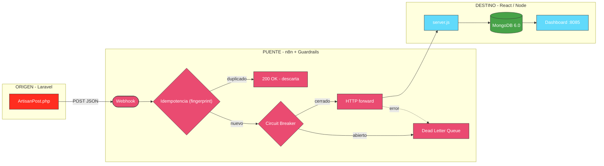
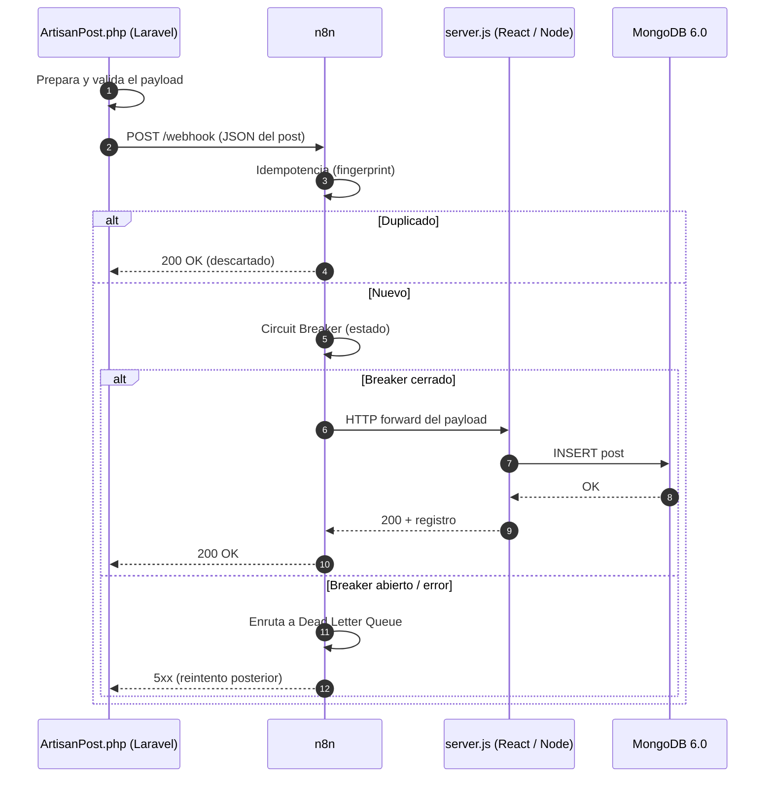

# 📐 Arquitectura — Caso 05: 🎼 Laravel → 🌉 n8n → ⚛️ React

[](https://laravel.com/)
[](https://react.dev/)
[](https://www.mongodb.com/)
[](https://n8n.io/)

> Emisor de automatización en **Laravel/Artisan (PHP Streams)** que publica hacia un receptor fullstack **React SPA + Node/Express**, orquestado por **n8n** con guardrails de resiliencia (idempotencia, circuit breaker, DLQ) y persistencia documental en **MongoDB**.

---

## 🧭 Ficha técnica

| Atributo | Valor |
| :--- | :--- |
| **ID** | `05` |
| **Origen** | Laravel 8.2 (PHP · Artisan) — [`origin/ArtisanPost.php`](origin/ArtisanPost.php) |
| **Puente** | n8n — [`case-05-laravel-to-react.json`](../../n8n/workflows/case-05-laravel-to-react.json) |
| **Destino** | React SPA + Node/Express — [`dest/server.js`](dest/server.js) |
| **Persistencia** | MongoDB 6.0 |
| **Puerto (dashboard)** | [`http://localhost:8085`](http://localhost:8085) |
| **Perfil Docker** | `case05` |
| **Guardrails** | Idempotencia · Circuit Breaker · Dead Letter Queue |

---

## 🗺️ Diagrama de arquitectura



---

## 🔁 Diagrama de secuencia (ciclo de una publicación)



---

## 🧩 Componentes

### 🎼 Origen — Laravel Artisan Simulator

- Clase que imita un `Console Command` de Artisan: extrae las publicaciones pendientes de `posts.json` y las despacha hacia el webhook de n8n.
- Emplea **PHP Streams** para envíos HTTP eficientes y ligeros.

### 🌉 Puente — n8n

- Recibe el webhook, aplica **idempotencia** (descarta duplicados por fingerprint), pasa por el **Circuit Breaker** y reenvía al destino. Los fallos se enrutan a la **Dead Letter Queue**.

### ⚛️ Destino — React / Node Fullstack

- `server.js` (Node/Express) recibe el post, lo valida y lo persiste en **MongoDB** preservando su estructura documental. La **Single Page Application** de React (`:8085`) visualiza los posts con actualizaciones periódicas y una estética profesional.

---

## ▶️ Cómo levantarlo

```bash
docker-compose --profile case05 up -d       # levanta receptor React/Node + MongoDB + n8n
python hub.py ejecutar 05-laravel-to-react   # dispara el emisor Laravel
```

Dashboard: [`http://localhost:8085`](http://localhost:8085)

---

## 🔗 Enlaces

- 📄 [README del caso](README.md)
- 🗺️ [Arquitectura global del laboratorio](../../docs/ARCHITECTURE.md)
- 🛡️ [Guardrails de resiliencia](../../docs/GUARDRAILS.md)
- 🧩 [Índice de casos](../../docs/CASES_INDEX.md)

---

*Diagramas en [Mermaid](https://mermaid.js.org/) — se renderizan nativamente en GitHub. Parte de **Social Bot Scheduler**.*
