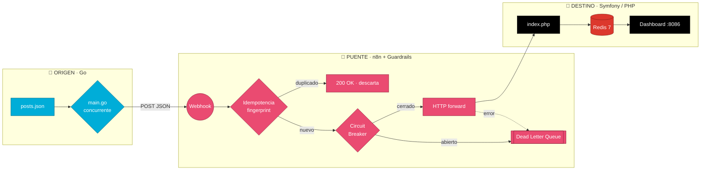
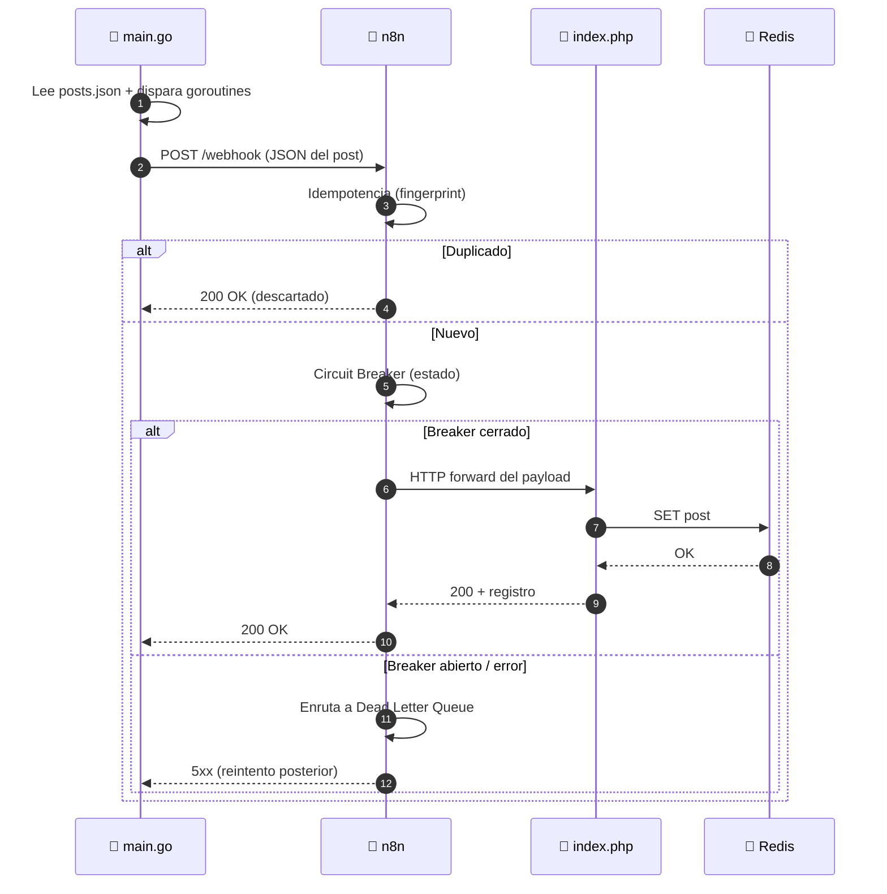

# 📐 Arquitectura — Caso 06: 🐹 Go → 🌉 n8n → 🎵 Symfony

[](https://go.dev/)
[](https://symfony.com/)
[](https://redis.io/)
[](https://n8n.io/)

> Emisor concurrente de alta velocidad en **Go** que publica hacia un receptor empresarial en **Symfony 7 / PHP 8.2**, orquestado por **n8n** con guardrails de resiliencia (idempotencia, circuit breaker, DLQ) y persistencia ultra-rápida en **Redis**.

---

## 🧭 Ficha técnica

| Atributo | Valor |
| :--- | :--- |
| **ID** | `06` |
| **Origen** | Go 1.21 — emisor concurrente — [`origin/main.go`](origin/main.go) |
| **Puente** | n8n — [`case-06-go-to-symfony.json`](../../n8n/workflows/case-06-go-to-symfony.json) |
| **Destino** | Symfony 7 / PHP 8.2 sobre Apache 2.4 — [`dest/index.php`](dest/index.php) |
| **Persistencia** | Redis 7 (In-Memory Key-Value) |
| **Puerto (dashboard)** | [`http://localhost:8086`](http://localhost:8086) |
| **Perfil Docker** | `case06` |
| **Guardrails** | Idempotencia · Circuit Breaker · Dead Letter Queue |

---

## 🗺️ Diagrama de arquitectura



---

## 🔁 Diagrama de secuencia (ciclo de una publicación)



---

## 🧩 Componentes

### 🐹 Origen — Go Concurrent Dispatcher

- Carga `posts.json`, calcula los tiempos de envío y **dispara las peticiones HTTP de forma concurrente** hacia el webhook de n8n.
- Optimizado para un consumo de memoria inferior a los 20 MB durante ráfagas de tráfico.

### 🌉 Puente — n8n

- Recibe el webhook, aplica **idempotencia** (descarta duplicados por fingerprint), pasa por el **Circuit Breaker** y reenvía al destino. Los fallos se enrutan a la **Dead Letter Queue**.

### 🎵 Destino — Symfony / PHP

- `index.php` (Symfony 7 sobre Apache 2.4) parsea el payload entrante, lo persiste en **Redis** para acceso instantáneo y lo sirve en un dashboard de administración (`:8086`) para monitorizar los flujos de datos.

---

## ▶️ Cómo levantarlo

```bash
docker-compose --profile case06 up -d      # levanta receptor Symfony + Redis + n8n
python hub.py ejecutar 06-go-to-symfony     # dispara el emisor Go
```

Dashboard: [`http://localhost:8086`](http://localhost:8086)

---

## 🔗 Enlaces

- 📄 [README del caso](README.md)
- 🗺️ [Arquitectura global del laboratorio](../../docs/ARCHITECTURE.md)
- 🛡️ [Guardrails de resiliencia](../../docs/GUARDRAILS.md)
- 🧩 [Índice de casos](../../docs/CASES_INDEX.md)

---

*Diagramas en [Mermaid](https://mermaid.js.org/) — se renderizan nativamente en GitHub. Parte de **Social Bot Scheduler**.*
