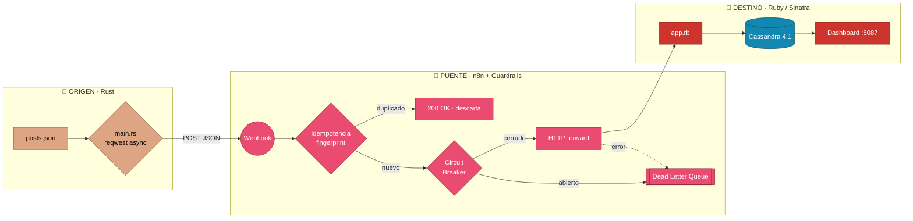
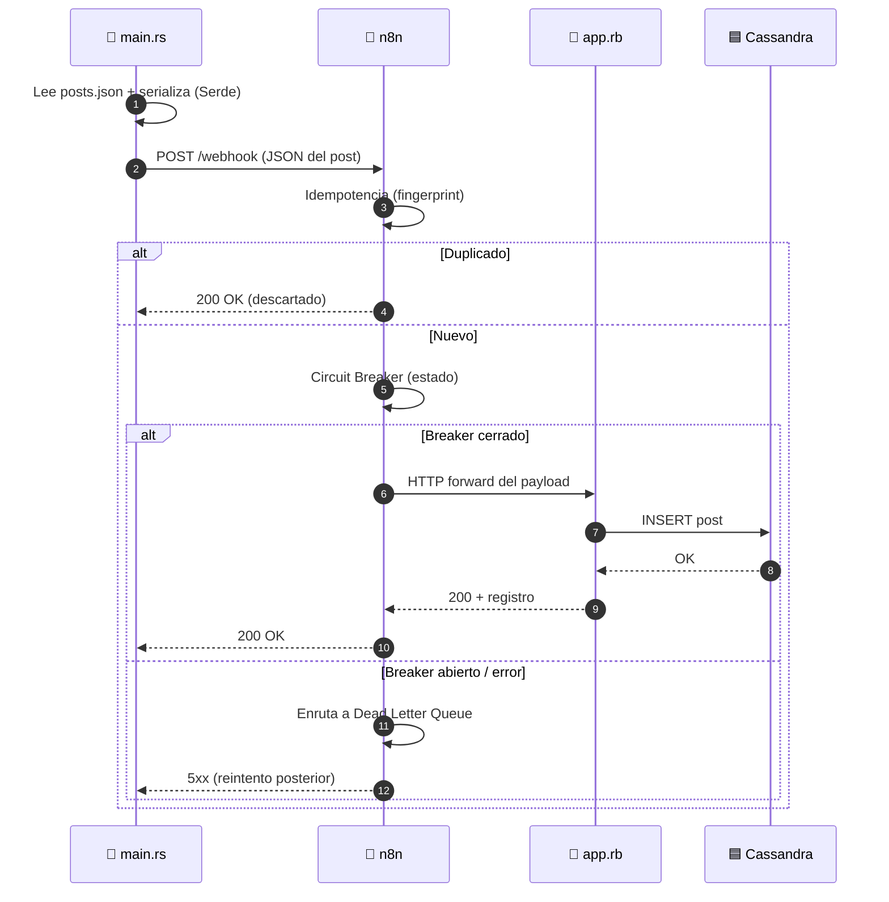

# 📐 Arquitectura — Caso 07: 🦀 Rust → 🌉 n8n → 💎 Ruby

[](https://www.rust-lang.org/)
[](https://www.ruby-lang.org/)
[](https://cassandra.apache.org/)
[](https://n8n.io/)

> Emisor asíncrono fuertemente tipado en **Rust** (cliente `reqwest` 0.12 + `dotenvy`) que publica hacia un receptor ágil en **Ruby 3.2 / Sinatra**, orquestado por **n8n** con guardrails de resiliencia (idempotencia, circuit breaker, DLQ) y persistencia distribuida en **Cassandra**.

---

## 🧭 Ficha técnica

| Atributo | Valor |
| :--- | :--- |
| **ID** | `07` |
| **Origen** | Rust 1.7x — cliente `reqwest` 0.12 + `dotenvy` — [`origin/src/main.rs`](origin/src/main.rs) |
| **Puente** | n8n — [`case-07-rust-to-ruby.json`](../../n8n/workflows/case-07-rust-to-ruby.json) |
| **Destino** | Ruby 3.2 / Sinatra sobre Puma — [`dest/app.rb`](dest/app.rb) |
| **Persistencia** | Cassandra 4.1 (Columnar Distribuido) |
| **Puerto (dashboard)** | [`http://localhost:8087`](http://localhost:8087) |
| **Perfil Docker** | `case07` |
| **Guardrails** | Idempotencia · Circuit Breaker · Dead Letter Queue |

---

## 🗺️ Diagrama de arquitectura



---

## 🔁 Diagrama de secuencia (ciclo de una publicación)



---

## 🧩 Componentes

### 🦀 Origen — Rust Safety Dispatcher

- Utiliza estructuras (`structs`) y **Serde** para una serialización ultra rápida de los posts, garantizando la integridad de los datos antes del envío mediante su sistema de tipos.
- Cliente **`reqwest` 0.12** asíncrono (con `dotenvy` para la configuración) para despachos masivos sin bloqueo hacia el webhook de n8n.

### 🌉 Puente — n8n

- Recibe el webhook, aplica **idempotencia** (descarta duplicados por fingerprint), pasa por el **Circuit Breaker** y reenvía al destino. Los fallos se enrutan a la **Dead Letter Queue**.

### 💎 Destino — Ruby / Sinatra

- `app.rb` (Sinatra DSL sobre el servidor Puma) gestiona los eventos entrantes, los persiste en **Cassandra** —ideal para flujos de alta escritura— y renderiza un dashboard dinámico con plantillas **ERB** (`:8087`).

---

## ▶️ Cómo levantarlo

```bash
docker-compose --profile case07 up -d      # levanta receptor Ruby + Cassandra + n8n
python hub.py ejecutar 07-rust-to-ruby      # dispara el emisor Rust
```

Dashboard: [`http://localhost:8087`](http://localhost:8087)

---

## 🔗 Enlaces

- 📄 [README del caso](README.md)
- 🗺️ [Arquitectura global del laboratorio](../../docs/ARCHITECTURE.md)
- 🛡️ [Guardrails de resiliencia](../../docs/GUARDRAILS.md)
- 🧩 [Índice de casos](../../docs/CASES_INDEX.md)

---

*Diagramas en [Mermaid](https://mermaid.js.org/) — se renderizan nativamente en GitHub. Parte de **Social Bot Scheduler**.*
