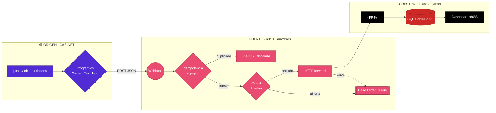
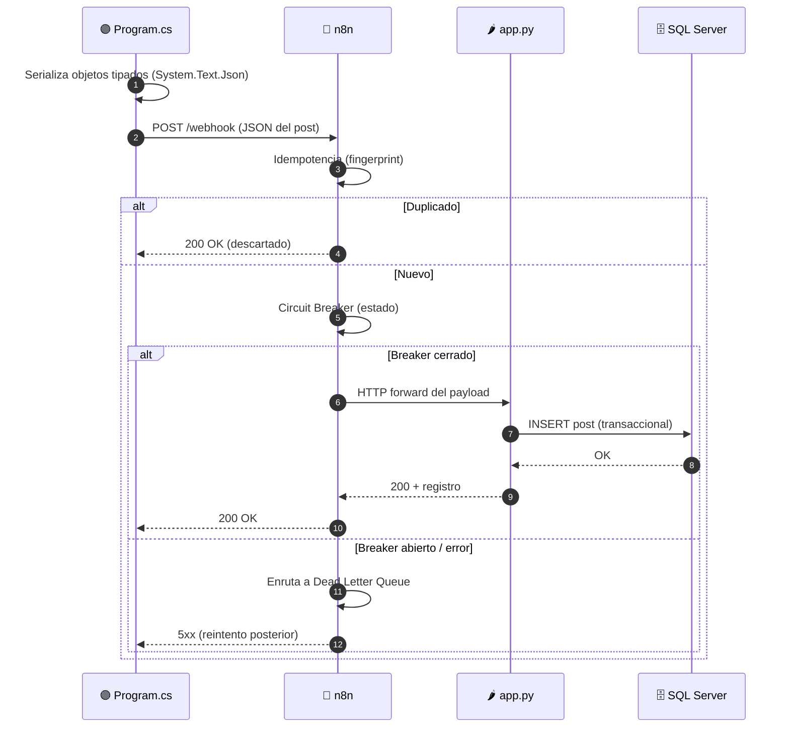

# 📐 Arquitectura — Caso 08: 🟣 C# (.NET) → 🌉 n8n → 🌶️ Flask

[](https://learn.microsoft.com/en-us/dotnet/csharp/)
[](https://flask.palletsprojects.com/)
[](https://www.microsoft.com/sql-server/)
[](https://n8n.io/)

> Emisor corporativo de alto rendimiento en **C# / .NET 8.0** que despacha vía **HttpClient** hacia un receptor liviano en **Flask/Jinja2**, orquestado por **n8n** con guardrails de resiliencia (idempotencia, circuit breaker, DLQ) y persistencia transaccional en **SQL Server**.

---

## 🧭 Ficha técnica

| Atributo | Valor |
| :--- | :--- |
| **ID** | `08` |
| **Origen** | C# / .NET 8.0 — [`origin/Program.cs`](origin/Program.cs) |
| **Puente** | n8n — [`case-08-csharp-to-flask.json`](../../n8n/workflows/case-08-csharp-to-flask.json) |
| **Destino** | Flask (Python) sobre Jinja2 — [`dest/app.py`](dest/app.py) |
| **Persistencia** | SQL Server 2022 |
| **Puerto (dashboard)** | [`http://localhost:8088`](http://localhost:8088) |
| **Perfil Docker** | `case08` |
| **Guardrails** | Idempotencia · Circuit Breaker · Dead Letter Queue |

---

## 🗺️ Diagrama de arquitectura



---

## 🔁 Diagrama de secuencia (ciclo de una publicación)



---

## 🧩 Componentes

### 🟣 Origen — .NET Enterprise Dispatcher

- `Program.cs` define objetos anónimos tipados, los **serializa con System.Text.Json** y los despacha vía **HttpClient** hacia el webhook de n8n.
- Uso de inyección de dependencias y clientes HTTP optimizados para rendimiento masivo del ecosistema corporativo de Microsoft .NET.

### 🌉 Puente — n8n

- Recibe el webhook, aplica **idempotencia** (descarta duplicados por fingerprint), pasa por el **Circuit Breaker** con política de reintentos (3 intentos, intervalo 1s) y reenvía al destino. Los fallos se enrutan a la **Dead Letter Queue** para auditoría y recuperación.

### 🌶️ Destino — Flask / Python

- `app.py` recibe el payload con **Flask**, lo procesa de forma asíncrona y lo persiste en **SQL Server 2022**, garantizando la integridad relacional transaccional. El motor de plantillas **Jinja2** lo sirve en un dashboard web (`:8088`).

---

## ▶️ Cómo levantarlo

```bash
docker-compose --profile case08 up -d          # levanta receptor Flask + SQL Server + n8n
python hub.py ejecutar 08-csharp-to-flask       # dispara el emisor C# / .NET
```

Dashboard: [`http://localhost:8088`](http://localhost:8088)

---

## 🔗 Enlaces

- 📄 [README del caso](README.md)
- 🗺️ [Arquitectura global del laboratorio](../../docs/ARCHITECTURE.md)
- 🛡️ [Guardrails de resiliencia](../../docs/GUARDRAILS.md)
- 🧩 [Índice de casos](../../docs/CASES_INDEX.md)

---

*Diagramas en [Mermaid](https://mermaid.js.org/) — se renderizan nativamente en GitHub. Parte de **Social Bot Scheduler**.*
