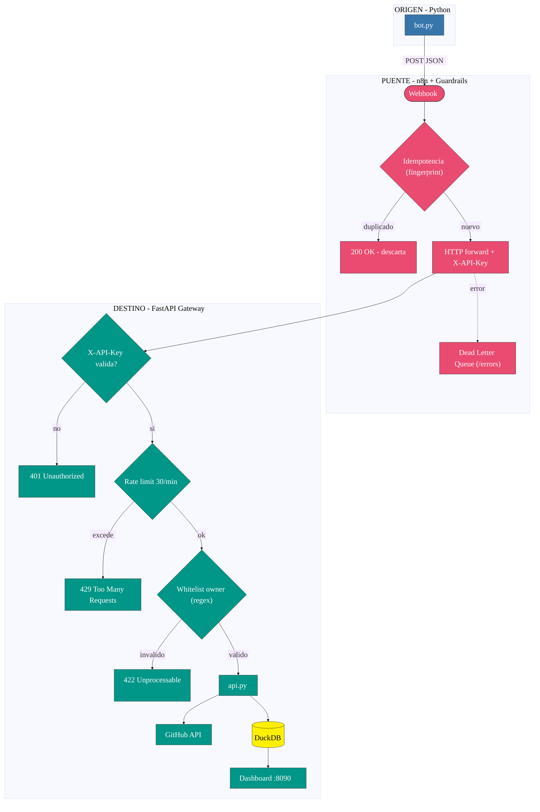
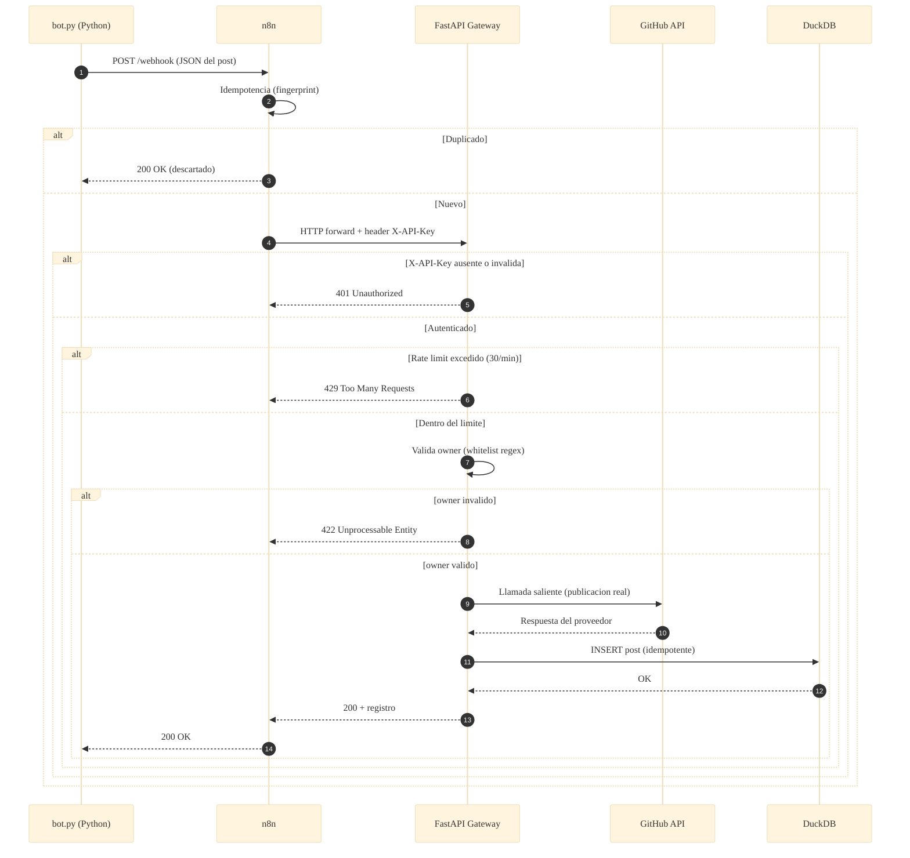

# 📐 Arquitectura — Caso 09: 🐍 Python → 🌉 n8n → ⚡ FastAPI Gateway

[](https://www.python.org/)
[](https://fastapi.tiangolo.com/)
[](https://duckdb.org/)
[](https://n8n.io/)

> Emisor operativo en **Python** que publica hacia un **Integration Gateway** en **FastAPI** — el caso más endurecido del laboratorio —, orquestado por **n8n** con guardrails de resiliencia y un borde de seguridad reforzado (autenticación `X-API-Key`, rate limiting, whitelist de `owner`, idempotencia y DLQ), con persistencia embebida en **DuckDB** y proveedor externo **GitHub API**.

---

## 🧭 Ficha técnica

| Atributo | Valor |
| :--- | :--- |
| **ID** | `09` |
| **Origen** | Python 3.11 — [`origin/bot.py`](origin/bot.py) |
| **Puente** | n8n — [`case-09-python-to-gateway.json`](../../n8n/workflows/case-09-python-to-gateway.json) |
| **Destino** | Integration Gateway en FastAPI — [`dest/app/api.py`](dest/app/api.py) |
| **Persistencia** | DuckDB (embebida) + GitHub API (proveedor externo) |
| **Puerto (dashboard)** | [`http://localhost:8090`](http://localhost:8090) |
| **Perfil Docker** | `case09` |
| **Guardrails** | Autenticación `X-API-Key` · Rate limiting (429) · Whitelist `owner` (422) · Idempotencia · Dead Letter Queue |

---

## 🗺️ Diagrama de arquitectura



---

## 🔁 Diagrama de secuencia (ciclo de una publicación)



---

## 🧩 Componentes

### 🐍 Origen — Python Bot

- `bot.py` lee `posts.json`, prepara el payload y dispara hacia el webhook de n8n como emisor operativo del ciclo de integración.

### 🌉 Puente — n8n

- Recibe el webhook, aplica **idempotencia** (descarta duplicados por fingerprint) y **reenvía al Gateway inyectando el header `X-API-Key`**. Los fallos se enrutan a la **Dead Letter Queue** mediante el endpoint `/errors`.

### ⚡ Destino — FastAPI Integration Gateway

Este es el caso **más endurecido** del laboratorio; su borde concentra las defensas de seguridad:

- **🔑 Autenticación obligatoria `X-API-Key`**: todo acceso a `POST /webhook` exige la clave `INTEGRATION_API_KEY` (sin valores demo embebidos). Su ausencia o invalidez devuelve **401**.
- **🚦 Rate limiting (`slowapi`)**: límite por IP de **30/min** en `/webhook` y **60/min** en `/errors`; el excedente devuelve **HTTP 429**. Contiene el agotamiento de la cuota de la GitHub API y el abuso de una `X-API-Key` filtrada.
- **✅ Whitelist de `owner`**: el campo `owner` se valida en el borde contra el patrón de usuario de GitHub (`^[A-Za-z0-9](?:[A-Za-z0-9-]{0,37}[A-Za-z0-9])?$`) vía **pydantic → 422**, como defensa en profundidad sobre el value object `Owner` del dominio. Rechaza barras, `@` y encodings que pudieran redirigir la llamada saliente.
- **♻️ Idempotencia por fingerprint**: evita el reprocesamiento de eventos duplicados.
- **📥 DLQ vía `/errors`**: los mensajes fallidos se derivan a la cola de auditoría para su recuperación.
- **🐙 Proveedor externo GitHub API**: realiza la publicación real saliente cuando `GITHUB_TOKEN` está configurado.
- **🦆 Persistencia DuckDB**: base OLAP in-process que permite consultas analíticas sobre el histórico de posts con latencia casi nula, servidas en el dashboard (`:8090`).

---

## ▶️ Cómo levantarlo

```bash
docker-compose --profile case09 up -d          # levanta Gateway FastAPI + DuckDB + n8n
python hub.py ejecutar 09-python-to-gateway     # dispara el emisor Python
```

Dashboard: [`http://localhost:8090`](http://localhost:8090)

---

## 🔗 Enlaces

- 📄 [README del caso](README.md)
- 🗺️ [Arquitectura global del laboratorio](../../docs/ARCHITECTURE.md)
- 🛡️ [Guardrails de resiliencia](../../docs/GUARDRAILS.md)
- 🧩 [Índice de casos](../../docs/CASES_INDEX.md)

---

*Diagramas en [Mermaid](https://mermaid.js.org/) — se renderizan nativamente en GitHub. Parte de **Social Bot Scheduler**.*
