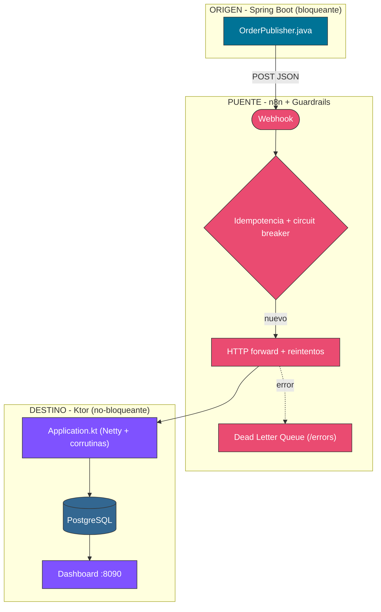
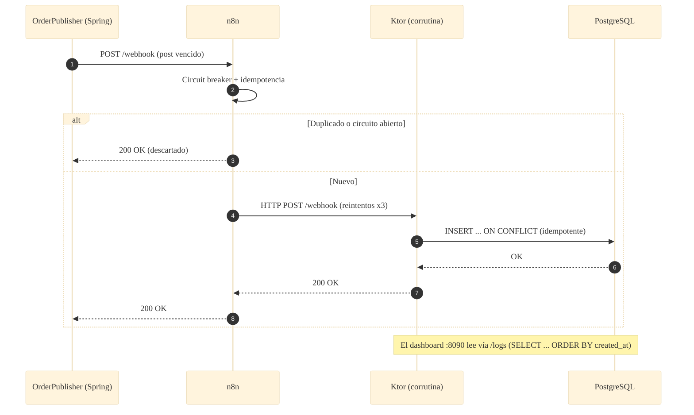

# 📐 Arquitectura — Caso 10: ☕ Java (Spring Boot) → 🌉 n8n → 🟣 Kotlin (Ktor) + PostgreSQL

[](https://openjdk.org/)
[](https://ktor.io/)
[](https://www.postgresql.org/)
[](https://n8n.io/)

> Emisor **Spring Boot** (MVC bloqueante) que reenvía a **n8n**; el receptor **Ktor** (no-bloqueante, corrutinas) persiste en **PostgreSQL**. Demuestra la interoperabilidad entre dos runtimes JVM con modelos de concurrencia opuestos.

---

## 🧭 Ficha técnica

| Atributo | Valor |
| :--- | :--- |
| **ID** | `10` |
| **Origen** | Java 21 / Spring Boot — [`origin/src/main/java/socialbot/OrderPublisher.java`](origin/src/main/java/socialbot/OrderPublisher.java) |
| **Puente** | n8n — [`case-10-java-to-kotlin.json`](../../n8n/workflows/case-10-java-to-kotlin.json) |
| **Destino** | Kotlin / Ktor (Netty) — [`dest/src/main/kotlin/Application.kt`](dest/src/main/kotlin/Application.kt) |
| **Persistencia** | PostgreSQL 16 (`social_posts`) |
| **Puerto (dashboard)** | [`http://localhost:8090`](http://localhost:8090) |
| **Perfil Docker** | `case10` |

---

## 🗺️ Diagrama de arquitectura



---

## 🔁 Diagrama de secuencia (ciclo de una publicación)



---

## 🧩 Componentes

### ☕ Origen — Spring Boot (MVC bloqueante)

- `OrderPublisher.java` (`@SpringBootApplication` + `CommandLineRunner`) usa `RestTemplate` para reenviar los posts vencidos a n8n. Modelo de un hilo por request.

### 🌉 Puente — n8n

- Guardrails canónicos: fingerprint → circuit breaker → idempotencia → HTTP forward con reintentos → DLQ.

### 🟣 Destino — Ktor (no-bloqueante)

- `Application.kt` levanta Ktor sobre Netty; cada request se maneja en una **corrutina** suspendible. Persistencia vía JDBC directo con `INSERT ... ON CONFLICT`.
- Empaquetado como **fat-jar** (Shadow) sobre `eclipse-temurin:21-jre-alpine`.

---

## ▶️ Cómo levantarlo

```bash
docker-compose --profile case10 up -d          # PostgreSQL + receptor Ktor
```

Dashboard: [`http://localhost:8090`](http://localhost:8090)

---

## 🔗 Enlaces

- 📄 [README del caso](README.md)
- 🗺️ [Arquitectura global del laboratorio](../../docs/ARCHITECTURE.md)
- 🛡️ [Guardrails de resiliencia](../../docs/GUARDRAILS.md)
- 🧩 [Índice de casos](../../docs/CASES_INDEX.md)

---

*Diagramas en [Mermaid](https://mermaid.js.org/) — se renderizan nativamente en GitHub. Parte de **Social Bot Scheduler**.*
