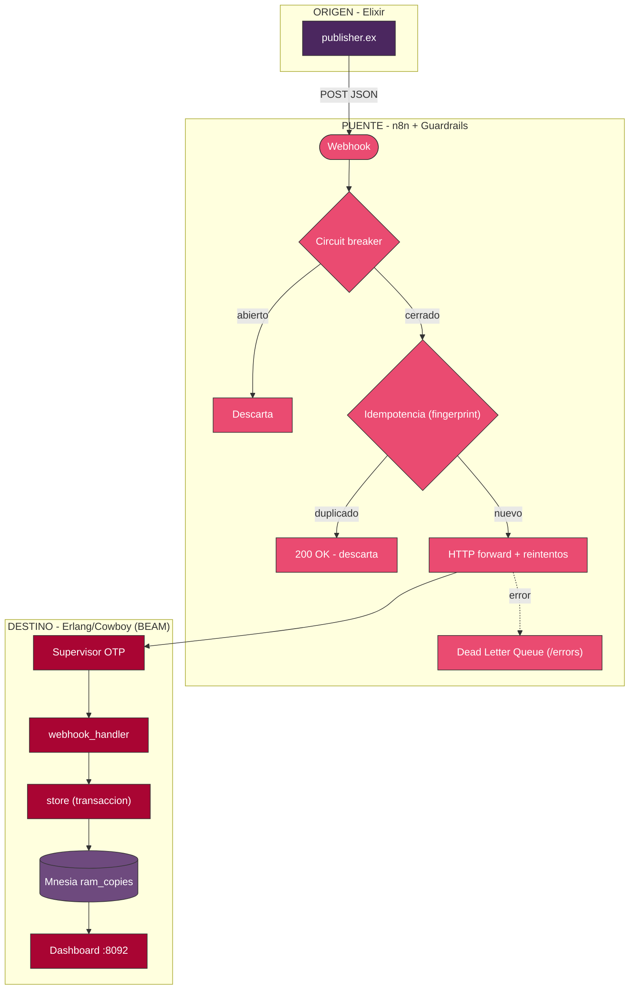
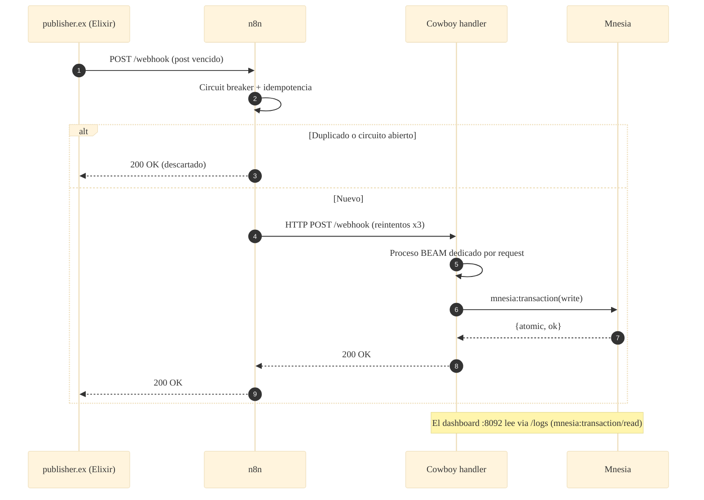

# 📐 Arquitectura — Caso 11: 💧 Elixir → 🌉 n8n → 🔴 Erlang (Cowboy) + Mnesia

[](https://elixir-lang.org/)
[](https://www.erlang.org/)
[](https://www.erlang.org/doc/apps/mnesia/)
[](https://n8n.io/)

> Emisor **Elixir** que reenvía posts vencidos a **n8n**; el receptor **Erlang/Cowboy** los persiste en **Mnesia**, la BD nativa de la BEAM embebida en el runtime. Demuestra el modelo de actores, la supervisión OTP y el patrón "let it crash".

---

## 🧭 Ficha técnica

| Atributo | Valor |
| :--- | :--- |
| **ID** | `11` |
| **Origen** | Elixir — [`origin/lib/publisher.ex`](origin/lib/publisher.ex) |
| **Puente** | n8n — [`case-11-elixir-to-erlang.json`](../../n8n/workflows/case-11-elixir-to-erlang.json) |
| **Destino** | Erlang/Cowboy 2.12 (release OTP) — [`dest/src/social_bot_dest_app.erl`](dest/src/social_bot_dest_app.erl) |
| **Persistencia** | Mnesia (`ram_copies`, embebida) |
| **Puerto (dashboard)** | [`http://localhost:8092`](http://localhost:8092) |
| **Perfil Docker** | `case11` |
| **Guardrails** | Fingerprint · Circuit breaker · Idempotencia · HTTP con reintentos · DLQ |

---

## 🗺️ Diagrama de arquitectura



---

## 🔁 Diagrama de secuencia (ciclo de una publicación)



---

## 🧩 Componentes

### 💧 Origen — Elixir

- `origin/lib/publisher.ex` lee `posts.json` y reenvía los posts vencidos a n8n. Sin dependencias: `:httpc` para HTTP y el módulo `:json` de OTP 27.

### 🌉 Puente — n8n

- Guardrails canónicos del laboratorio: **fingerprint → circuit breaker → idempotencia → HTTP forward con reintentos → DLQ**.

### 🔴 Destino — Erlang/Cowboy + Mnesia

- `social_bot_dest_app` inicializa Mnesia y levanta Cowboy; `social_bot_dest_sup` es el árbol de supervisión OTP.
- `webhook_handler` persiste cada post en una **transacción Mnesia**; `logs_handler` sirve los últimos registros; `dashboard_handler` sirve el HTML desde `priv/`.
- Empaquetado como **release OTP** con ERTS embebido.

---

## ▶️ Cómo levantarlo

```bash
docker-compose --profile case11 up -d          # receptor Erlang/Cowboy + Mnesia (sin BD externa)
```

Dashboard: [`http://localhost:8092`](http://localhost:8092)

---

## 🔗 Enlaces

- 📄 [README del caso](README.md)
- 🗺️ [Arquitectura global del laboratorio](../../docs/ARCHITECTURE.md)
- 🛡️ [Guardrails de resiliencia](../../docs/GUARDRAILS.md)
- 🧩 [Índice de casos](../../docs/CASES_INDEX.md)

---

*Diagramas en [Mermaid](https://mermaid.js.org/) — se renderizan nativamente en GitHub. Parte de **Social Bot Scheduler**.*
