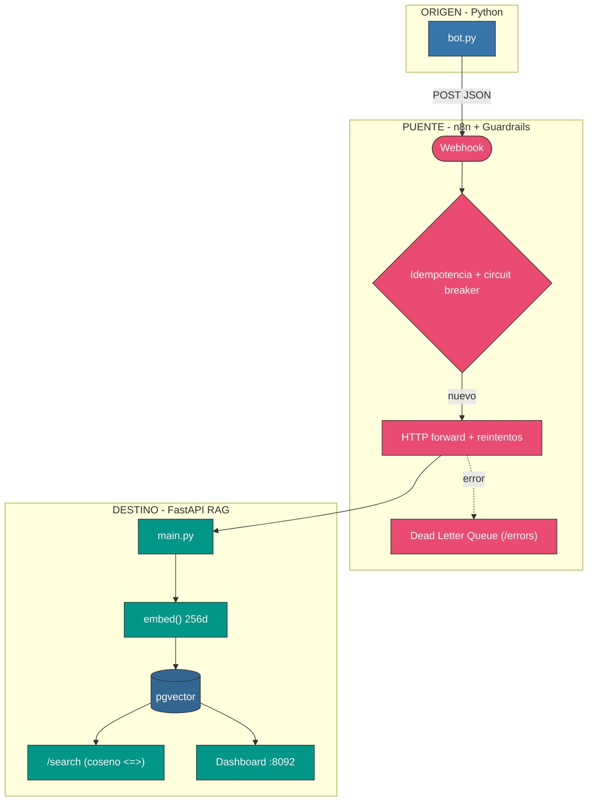
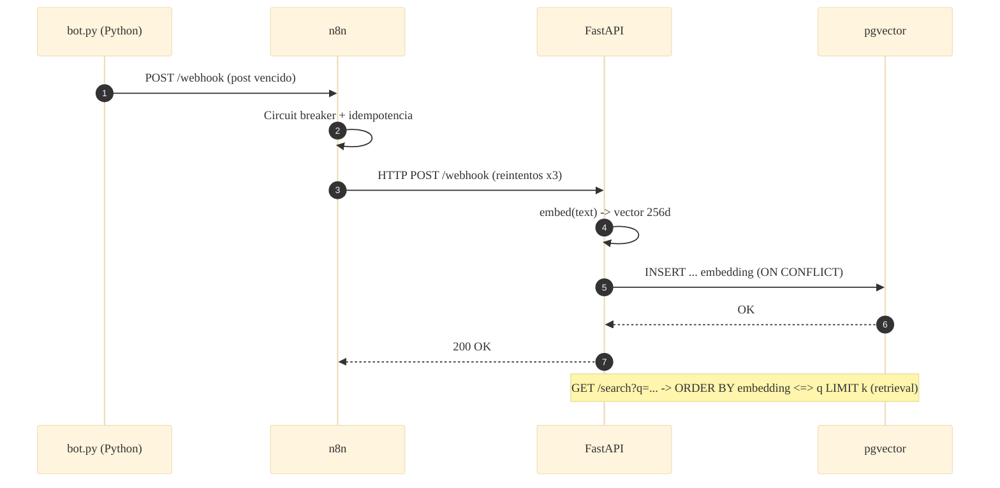

# 📐 Arquitectura — Caso 12: 🧠 Python (LLM) → 🌉 n8n → ⚡ FastAPI RAG + pgvector

[](https://www.python.org/)
[](https://fastapi.tiangolo.com/)
[](https://github.com/pgvector/pgvector)
[](https://n8n.io/)

> Emisor Python que reenvía a **n8n**; el receptor **FastAPI** embebe cada post e indexa el vector en **pgvector**, exponiendo búsqueda semántica por similitud coseno (`/search`) — el paso *retrieval* de un pipeline RAG.

---

## 🧭 Ficha técnica

| Atributo | Valor |
| :--- | :--- |
| **ID** | `12` |
| **Origen** | Python 3.11 — [`origin/bot.py`](origin/bot.py) |
| **Puente** | n8n — [`case-12-python-to-rag.json`](../../n8n/workflows/case-12-python-to-rag.json) |
| **Destino** | FastAPI — [`dest/main.py`](dest/main.py) |
| **Persistencia** | pgvector (PostgreSQL 16, `vector(256)`) |
| **Puerto (dashboard)** | [`http://localhost:8092`](http://localhost:8092) |
| **Perfil Docker** | `case12` |

---

## 🗺️ Diagrama de arquitectura



---

## 🔁 Diagrama de secuencia (ingesta + retrieval)



---

## 🧩 Componentes

### 🧠 Origen — Python

- `origin/bot.py` reenvía los posts vencidos a n8n con la stdlib (`urllib`), sin dependencias.

### 🌉 Puente — n8n

- Guardrails canónicos: fingerprint → circuit breaker → idempotencia → HTTP forward con reintentos → DLQ.

### ⚡ Destino — FastAPI RAG + pgvector

- `dest/main.py` embebe el texto (hashing determinista 256d) y lo indexa en pgvector. `/search` hace retrieval por coseno; `/logs` lista los últimos posts.
- La función de embedding es un **punto de extensión aislado** (swappable por un modelo real).

---

## ▶️ Cómo levantarlo

```bash
docker-compose --profile case12 up -d          # pgvector + receptor FastAPI
```

Dashboard: [`http://localhost:8092`](http://localhost:8092)

---

## 🔗 Enlaces

- 📄 [README del caso](README.md)
- 🗺️ [Arquitectura global del laboratorio](../../docs/ARCHITECTURE.md)
- 🛡️ [Guardrails de resiliencia](../../docs/GUARDRAILS.md)
- 🧩 [Índice de casos](../../docs/CASES_INDEX.md)

---

*Diagramas en [Mermaid](https://mermaid.js.org/) — se renderizan nativamente en GitHub. Parte de **Social Bot Scheduler**.*
