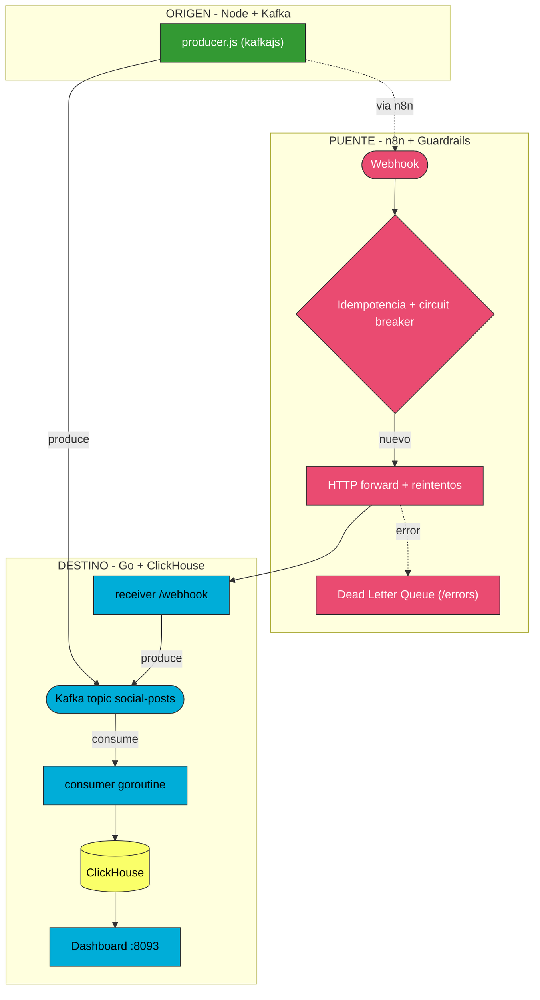
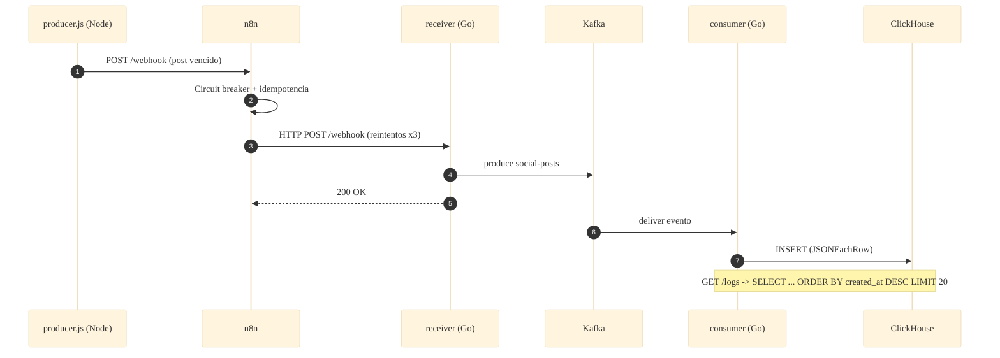

# 📐 Arquitectura — Caso 13: 🟢 Node+Kafka → 🌉 n8n → 🐹 Go → 📊 ClickHouse

[](https://nodejs.org/)
[](https://kafka.apache.org/)
[](https://go.dev/)
[](https://clickhouse.com/)

> Emisor **Node/kafkajs** produce eventos a **Kafka**; un consumer **Go** los proyecta ("sink") en **ClickHouse** (OLAP columnar). Patrón CQRS con dos entradas (Node directo y n8n→receiver) convergiendo en un único sink.

---

## 🧭 Ficha técnica

| Atributo | Valor |
| :--- | :--- |
| **ID** | `13` |
| **Origen** | Node/kafkajs — [`origin/producer.js`](origin/producer.js) |
| **Broker** | Kafka 3.8 (KRaft, topic `social-posts`) |
| **Puente** | n8n — [`case-13-node-to-go-kafka.json`](../../n8n/workflows/case-13-node-to-go-kafka.json) |
| **Destino** | Go (`kafka-go`) — [`dest/main.go`](dest/main.go) |
| **Persistencia** | ClickHouse 24 (`ReplacingMergeTree`) |
| **Puerto (dashboard)** | [`http://localhost:8093`](http://localhost:8093) |
| **Perfil Docker** | `case13` |

---

## 🗺️ Diagrama de arquitectura



---

## 🔁 Diagrama de secuencia (ciclo de una publicación vía n8n)



---

## 🧩 Componentes

### 🟢 Origen — Node + Kafka

- `origin/producer.js` (kafkajs) produce los posts en el topic `social-posts` y los reenvía a n8n.

### 🌉 Puente — n8n

- Guardrails canónicos: fingerprint → circuit breaker → idempotencia → HTTP forward con reintentos → DLQ.

### 🐹 Destino — Go + ClickHouse

- `dest/main.go` (`kafka-go`) es **producer** en `/webhook` y **consumer** en una goroutine que hace sink a ClickHouse vía su interfaz HTTP. Idempotente por `id` (`ReplacingMergeTree`).

---

## ▶️ Cómo levantarlo

```bash
docker-compose --profile case13 up -d          # Kafka + ClickHouse + consumer Go
```

Dashboard: [`http://localhost:8093`](http://localhost:8093)

---

## 🔗 Enlaces

- 📄 [README del caso](README.md)
- 🗺️ [Arquitectura global del laboratorio](../../docs/ARCHITECTURE.md)
- 🛡️ [Guardrails de resiliencia](../../docs/GUARDRAILS.md)
- 🧩 [Índice de casos](../../docs/CASES_INDEX.md)

---

*Diagramas en [Mermaid](https://mermaid.js.org/) — se renderizan nativamente en GitHub. Parte de **Social Bot Scheduler**.*
