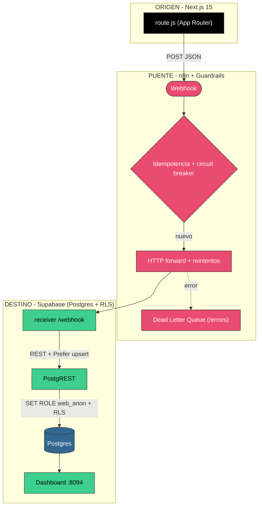

# 📐 Arquitectura — Caso 14: ▲ Next.js → 🌉 n8n → ⚡ Supabase (Postgres + RLS)

[](https://nextjs.org/)
[](https://postgrest.org/)
[](https://www.postgresql.org/)
[](https://n8n.io/)

> Emisor **Next.js** que reenvía a **n8n**; el receiver persiste en **Supabase** (Postgres + PostgREST) gobernado por **Row Level Security**. Reproduce el núcleo BaaS de Supabase sin la suite completa.

---

## 🧭 Ficha técnica

| Atributo | Valor |
| :--- | :--- |
| **ID** | `14` |
| **Origen** | Next.js 15 (App Router) — [`origin/app/api/emit/route.js`](origin/app/api/emit/route.js) |
| **Puente** | n8n — [`case-14-nextjs-to-supabase.json`](../../n8n/workflows/case-14-nextjs-to-supabase.json) |
| **Destino** | Receiver → PostgREST — [`dest/index.js`](dest/index.js) |
| **Persistencia** | Postgres 16 + RLS (`web_anon`) vía PostgREST |
| **Puerto (dashboard)** | [`http://localhost:8094`](http://localhost:8094) |
| **Perfil Docker** | `case14` |

---

## 🗺️ Diagrama de arquitectura



---

## 🔁 Diagrama de secuencia (ciclo de una publicación)

```mermaid
%%{init: {'theme':'base','themeVariables':{'fontSize':'24px','fontFamily':'Segoe UI, Arial, sans-serif'},'sequence':{'useMaxWidth':true,'actorFontSize':22,'messageFontSize':20,'noteFontSize':18,'actorMargin':80,'boxMargin':16,'width':170}}}%%
sequenceDiagram
    autonumber
    participant Next as route.js (Next.js)
    participant N8N as n8n
    participant Rec as receiver
    participant PR as PostgREST
    participant DB as Postgres (RLS)

    Next->>N8N: POST /webhook (post vencido)
    N8N->>N8N: Circuit breaker + idempotencia
    N8N->>Rec: HTTP POST /webhook (reintentos x3)
    Rec->>PR: POST /social_posts (Prefer: merge-duplicates)
    PR->>DB: SET ROLE web_anon; INSERT (RLS check)
    DB-->>PR: 201
    PR-->>Rec: 201
    Rec-->>N8N: 200 OK
    Note over PR,DB: GET /logs -> PostgREST GET /social_posts?order=created_at.desc
```

---

## 🧩 Componentes

### ▲ Origen — Next.js 15

- `origin/app/api/emit/route.js` (Route Handler) reenvía los posts a n8n; `origin/emit.mjs` es el equivalente CLI.

### 🌉 Puente — n8n

- Guardrails canónicos: fingerprint → circuit breaker → idempotencia → HTTP forward con reintentos → DLQ.

### ⚡ Destino — Supabase (Postgres + PostgREST + RLS)

- `dest/index.js` traduce `/webhook`→POST y `/logs`→GET contra **PostgREST**. La tabla tiene **RLS** habilitada; el rol `web_anon` (que PostgREST asume) gobierna el acceso vía política.

---

## ▶️ Cómo levantarlo

```bash
docker-compose --profile case14 up -d          # Postgres (RLS) + PostgREST + receiver
```

Dashboard: [`http://localhost:8094`](http://localhost:8094)

---

## 🔗 Enlaces

- 📄 [README del caso](README.md)
- 🗺️ [Arquitectura global del laboratorio](../../docs/ARCHITECTURE.md)
- 🛡️ [Guardrails de resiliencia](../../docs/GUARDRAILS.md)
- 🧩 [Índice de casos](../../docs/CASES_INDEX.md)

---

*Diagramas en [Mermaid](https://mermaid.js.org/) — se renderizan nativamente en GitHub. Parte de **Social Bot Scheduler**.*
