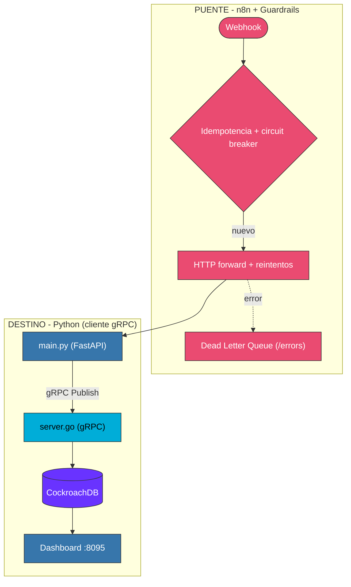
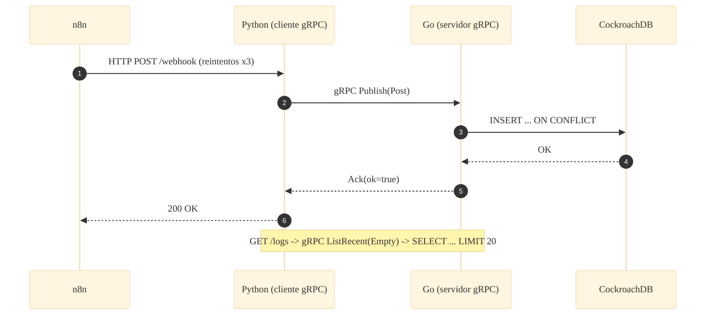

# 📐 Arquitectura — Caso 15: 🐹 Go (gRPC) → 🌉 n8n → 🐍 Python (gRPC) + CockroachDB

[](https://go.dev/)
[](https://grpc.io/)
[](https://fastapi.tiangolo.com/)
[](https://www.cockroachlabs.com/)

> Servidor **gRPC en Go** + cliente **gRPC en Python** sobre un contrato `.proto` compartido, con persistencia en **CockroachDB**. El receiver Python adapta el contrato REST del laboratorio a llamadas gRPC.

---

## 🧭 Ficha técnica

| Atributo | Valor |
| :--- | :--- |
| **ID** | `15` |
| **Origen** | Go (servidor gRPC) — [`origin/server.go`](origin/server.go) |
| **Contrato** | [`proto/social.proto`](proto/social.proto) |
| **Puente** | n8n — [`case-15-grpc-go-to-python.json`](../../n8n/workflows/case-15-grpc-go-to-python.json) |
| **Destino** | Python (cliente gRPC + FastAPI) — [`dest/main.py`](dest/main.py) |
| **Persistencia** | CockroachDB 24 (`social_posts`) |
| **Puerto (dashboard)** | [`http://localhost:8095`](http://localhost:8095) |
| **Perfil Docker** | `case15` |

---

## 🗺️ Diagrama de arquitectura



---

## 🔁 Diagrama de secuencia (ciclo de una publicación)



---

## 🧩 Componentes

### 🐹 Servidor — Go (gRPC)

- `origin/server.go` implementa `SocialService` (unary `Publish` y `ListRecent`) y persiste en CockroachDB vía `database/sql` + `lib/pq`. Los stubs se generan con `protoc` en el build.

### 🌉 Puente — n8n

- Guardrails canónicos: fingerprint → circuit breaker → idempotencia → HTTP forward con reintentos → DLQ.

### 🐍 Cliente — Python (FastAPI + grpcio)

- `dest/main.py` abre un canal gRPC al servidor Go y traduce `/webhook`→`Publish`, `/logs`→`ListRecent`. Adaptador REST↔gRPC porque n8n no habla gRPC nativo.

---

## ▶️ Cómo levantarlo

```bash
docker-compose --profile case15 up -d          # CockroachDB + servidor Go + receiver Python
```

Dashboard: [`http://localhost:8095`](http://localhost:8095)

---

## 🔗 Enlaces

- 📄 [README del caso](README.md)
- 🗺️ [Arquitectura global del laboratorio](../../docs/ARCHITECTURE.md)
- 🛡️ [Guardrails de resiliencia](../../docs/GUARDRAILS.md)
- 🧩 [Índice de casos](../../docs/CASES_INDEX.md)

---

*Diagramas en [Mermaid](https://mermaid.js.org/) — se renderizan nativamente en GitHub. Parte de **Social Bot Scheduler**.*
