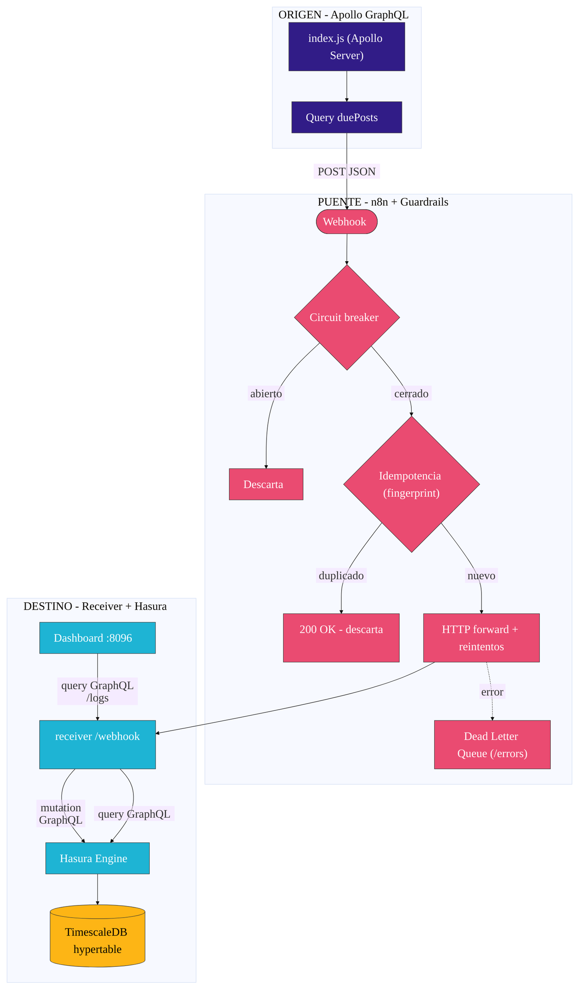
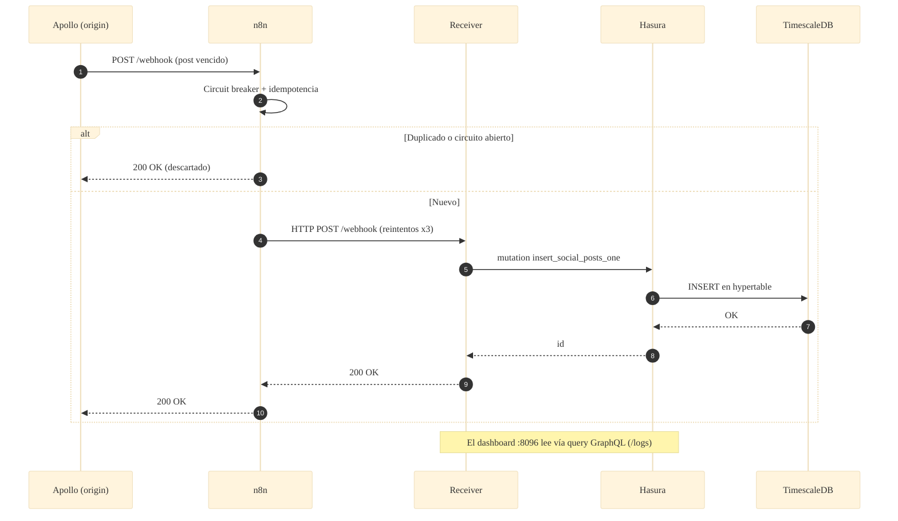

# 📐 Arquitectura — Caso 16: 🚀 Apollo GraphQL → 🌉 n8n → 🟦 Hasura → 📈 TimescaleDB

[](https://www.apollographql.com/)
[](https://hasura.io/)
[](https://www.timescale.com/)
[](https://n8n.io/)

> Emisor **schema-first** en Apollo Server que reenvía posts vencidos a **n8n**; un micro-receiver traduce el contrato REST del laboratorio a **mutaciones/queries GraphQL** contra **Hasura** (**DB-first**), con persistencia en **TimescaleDB** (hypertables particionadas por tiempo).

---

## 🧭 Ficha técnica

| Atributo | Valor |
| :--- | :--- |
| **ID** | `16` |
| **Origen** | Apollo Server 4 (Node.js) — [`origin/index.js`](origin/index.js) |
| **Puente** | n8n — [`case-16-graphql-to-hasura.json`](../../n8n/workflows/case-16-graphql-to-hasura.json) |
| **Destino** | Micro-receiver REST↔GraphQL — [`dest/receiver/index.js`](dest/receiver/index.js) |
| **Motor destino** | Hasura GraphQL Engine |
| **Persistencia** | TimescaleDB (hypertable `social_posts`) |
| **Puerto (dashboard)** | [`http://localhost:8096`](http://localhost:8096) |
| **Perfil Docker** | `case16` |
| **Guardrails** | Fingerprint · Circuit breaker · Idempotencia · HTTP con reintentos · DLQ |

---

## 🗺️ Diagrama de arquitectura



---

## 🔁 Diagrama de secuencia (ciclo de una publicación)



---

## 🧩 Componentes

### 🚀 Origen — Apollo GraphQL (schema-first)

- `origin/index.js` levanta **Apollo Server 4** con un schema escrito a mano (`ScheduledPost`, queries `scheduledPosts` y `duePosts`) y un daemon de polling que reenvía los posts vencidos al webhook de n8n.

### 🌉 Puente — n8n

- Aplica los guardrails canónicos del laboratorio: **fingerprint → circuit breaker → idempotencia → HTTP forward con reintentos → DLQ** vía `/errors`.

### 🟦 Destino — Receiver + Hasura (DB-first)

- `dest/receiver/index.js` traduce el contrato REST a GraphQL: en `/webhook` ejecuta una **mutation** contra Hasura; en `/logs` una **query**. Al arrancar, **trackea** la tabla vía Metadata API (idempotente).
- **Hasura** deriva el API GraphQL automáticamente del esquema Postgres, sin resolvers.
- **TimescaleDB** almacena los posts en una **hypertable** particionada por `created_at`.

---

## ▶️ Cómo levantarlo

```bash
docker-compose --profile case16 up -d          # TimescaleDB + Hasura + receiver
```

Dashboard: [`http://localhost:8096`](http://localhost:8096)

---

## 🔗 Enlaces

- 📄 [README del caso](README.md)
- 🗺️ [Arquitectura global del laboratorio](../../docs/ARCHITECTURE.md)
- 🛡️ [Guardrails de resiliencia](../../docs/GUARDRAILS.md)
- 🧩 [Índice de casos](../../docs/CASES_INDEX.md)

---

*Diagramas en [Mermaid](https://mermaid.js.org/) — se renderizan nativamente en GitHub. Parte de **Social Bot Scheduler**.*
