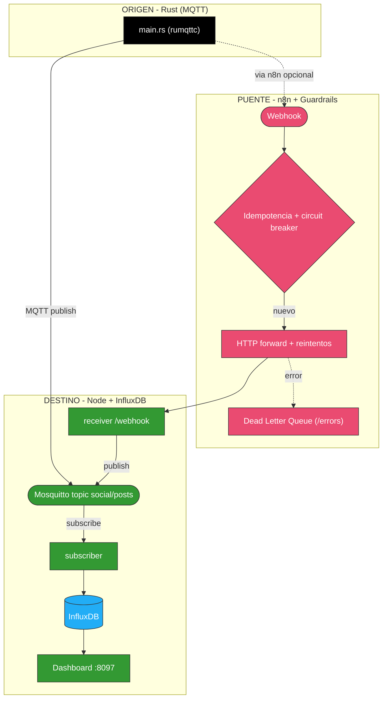
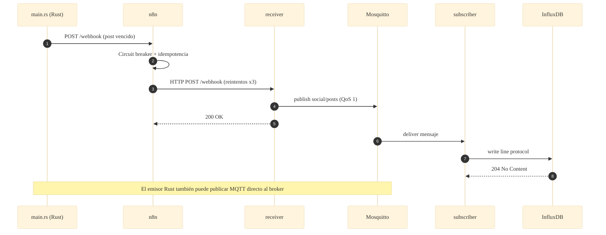

# 📐 Arquitectura — Caso 17: 🦀 Rust (MQTT) → 🌉 n8n → 🟢 Node → 📊 InfluxDB

[](https://www.rust-lang.org/)
[](https://mqtt.org/)
[](https://nodejs.org/)
[](https://www.influxdata.com/)

> Emisor **Rust** que publica por **MQTT** en Mosquitto; un **subscriber Node** persiste en **InfluxDB**. El receiver REST reinyecta la entrega de n8n en el mismo bus, unificando ambas entradas en un único sink de series temporales.

---

## 🧭 Ficha técnica

| Atributo | Valor |
| :--- | :--- |
| **ID** | `17` |
| **Origen** | Rust (`rumqttc`) — [`origin/src/main.rs`](origin/src/main.rs) |
| **Puente** | n8n — [`case-17-mqtt-rust-to-node.json`](../../n8n/workflows/case-17-mqtt-rust-to-node.json) |
| **Broker** | Mosquitto 2.x (topic `social/posts`, QoS 1) |
| **Destino** | Node subscriber + receiver REST — [`dest/index.js`](dest/index.js) |
| **Persistencia** | InfluxDB 1.8 (measurement `social_posts`) |
| **Puerto (dashboard)** | [`http://localhost:8097`](http://localhost:8097) |
| **Perfil Docker** | `case17` |

---

## 🗺️ Diagrama de arquitectura



---

## 🔁 Diagrama de secuencia (ciclo de una publicación vía n8n)



---

## 🧩 Componentes

### 🦀 Origen — Rust (MQTT publisher)

- `origin/src/main.rs` usa `rumqttc` (síncrono, sin TLS) para publicar los posts en `social/posts`. Perfil release con LTO + strip → binario mínimo.

### 🌉 Puente — n8n

- Guardrails canónicos: fingerprint → circuit breaker → idempotencia → HTTP forward con reintentos → DLQ.

### 🟢 Destino — Node + InfluxDB

- `dest/index.js` es a la vez **subscriber** (MQTT → InfluxDB) y **receiver REST** (`/webhook` publica en MQTT). Un único sink, dos entradas.
- **InfluxDB 1.8** almacena `social_posts` como serie temporal; `/logs` consulta con InfluxQL.

---

## ▶️ Cómo levantarlo

```bash
docker-compose --profile case17 up -d          # Mosquitto + InfluxDB + receiver Node
```

Dashboard: [`http://localhost:8097`](http://localhost:8097)

---

## 🔗 Enlaces

- 📄 [README del caso](README.md)
- 🗺️ [Arquitectura global del laboratorio](../../docs/ARCHITECTURE.md)
- 🛡️ [Guardrails de resiliencia](../../docs/GUARDRAILS.md)
- 🧩 [Índice de casos](../../docs/CASES_INDEX.md)

---

*Diagramas en [Mermaid](https://mermaid.js.org/) — se renderizan nativamente en GitHub. Parte de **Social Bot Scheduler**.*
