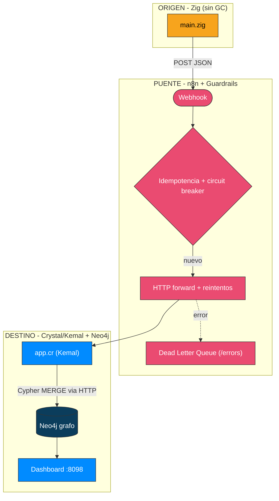
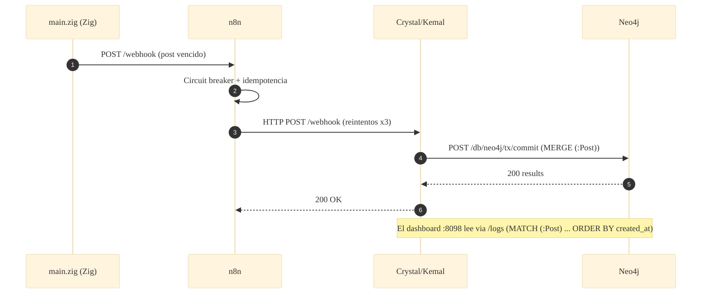

# 📐 Arquitectura — Caso 18: ⚡ Zig → 🌉 n8n → 💎 Crystal (Kemal) + Neo4j

[](https://ziglang.org/)
[](https://crystal-lang.org/)
[](https://neo4j.com/)
[](https://n8n.io/)

> Emisor **Zig** (sin GC) que reenvía a **n8n**; el receptor **Crystal/Kemal** persiste cada post como un nodo `(:Post)` del grafo **Neo4j**, accedido por su API HTTP transaccional con **Cypher**.

---

## 🧭 Ficha técnica

| Atributo | Valor |
| :--- | :--- |
| **ID** | `18` |
| **Origen** | Zig 0.13 — [`origin/src/main.zig`](origin/src/main.zig) |
| **Puente** | n8n — [`case-18-zig-to-crystal.json`](../../n8n/workflows/case-18-zig-to-crystal.json) |
| **Destino** | Crystal / Kemal — [`dest/src/app.cr`](dest/src/app.cr) |
| **Persistencia** | Neo4j 5 (nodos `(:Post)`, Cypher) |
| **Puerto (dashboard)** | [`http://localhost:8098`](http://localhost:8098) |
| **Perfil Docker** | `case18` |

---

## 🗺️ Diagrama de arquitectura



---

## 🔁 Diagrama de secuencia (ciclo de una publicación)



---

## 🧩 Componentes

### ⚡ Origen — Zig

- `origin/src/main.zig` lee `posts.json` y reenvía los posts vencidos con `std.http.Client.fetch`. Compilado en `ReleaseSmall` (binario estático mínimo).

### 🌉 Puente — n8n

- Guardrails canónicos: fingerprint → circuit breaker → idempotencia → HTTP forward con reintentos → DLQ.

### 💎 Destino — Crystal/Kemal + Neo4j

- `dest/src/app.cr` (Kemal) traduce el contrato REST a **Cypher** contra la API HTTP transaccional de Neo4j. `MERGE (:Post {id})` en `/webhook`; `MATCH (:Post)` en `/logs`.
- Compilado con `crystal build --release`.

---

## ▶️ Cómo levantarlo

```bash
docker-compose --profile case18 up -d          # Neo4j + receptor Crystal
```

Dashboard: [`http://localhost:8098`](http://localhost:8098)

---

## 🔗 Enlaces

- 📄 [README del caso](README.md)
- 🗺️ [Arquitectura global del laboratorio](../../docs/ARCHITECTURE.md)
- 🛡️ [Guardrails de resiliencia](../../docs/GUARDRAILS.md)
- 🧩 [Índice de casos](../../docs/CASES_INDEX.md)

---

*Diagramas en [Mermaid](https://mermaid.js.org/) — se renderizan nativamente en GitHub. Parte de **Social Bot Scheduler**.*
