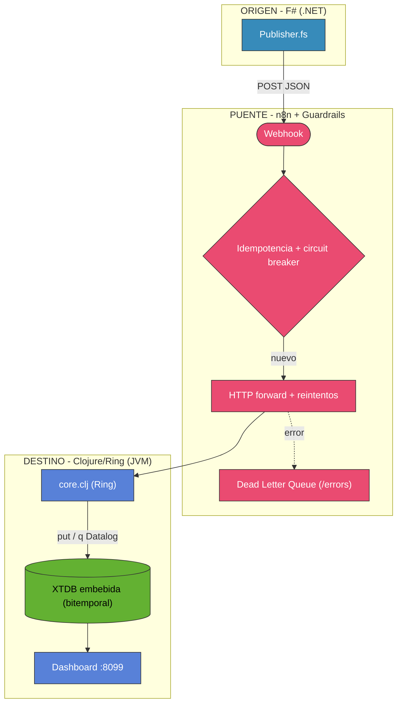
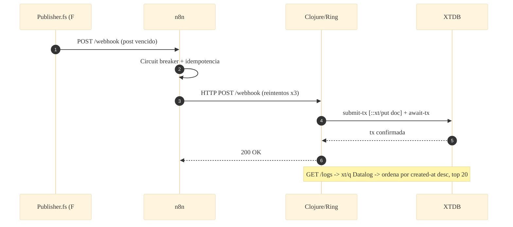

# 📐 Arquitectura — Caso 19: #️⃣ F# (.NET) → 🌉 n8n → 🍀 Clojure (Ring) + XTDB

[]()
[](https://fsharp.org/)
[](https://clojure.org/)
[](https://xtdb.com/)
[](https://n8n.io/)

> Emisor **F#** (funcional-first sobre .NET) que reenvía a **n8n**; el receptor **Clojure/Ring** persiste en **XTDB**, una BD **bitemporal e inmutable** embebida in-process. Dos runtimes funcionales, cero contenedor de BD.

---

## 🧭 Ficha técnica

| Atributo | Valor |
| :--- | :--- |
| **ID** | `19` |
| **Origen** | F# / .NET 9 — [`origin/Publisher.fs`](origin/Publisher.fs) |
| **Puente** | n8n — [`case-19-fsharp-to-clojure.json`](../../n8n/workflows/case-19-fsharp-to-clojure.json) |
| **Destino** | Clojure / Ring — [`dest/src/receiver/core.clj`](dest/src/receiver/core.clj) |
| **Persistencia** | XTDB 1.24 (bitemporal, embebida in-memory) |
| **Puerto (dashboard)** | [`http://localhost:8099`](http://localhost:8099) |
| **Perfil Docker** | `case19` |

---

## 🗺️ Diagrama de arquitectura



---

## 🔁 Diagrama de secuencia (ciclo de una publicación)



---

## 🧩 Componentes

### #️⃣ Origen — F# (.NET)

- `origin/Publisher.fs` reenvía los posts vencidos a n8n con `HttpClient`. Estilo funcional (inmutable, expresiones).

### 🌉 Puente — n8n

- Guardrails canónicos: fingerprint → circuit breaker → idempotencia → HTTP forward con reintentos → DLQ.

### 🍀 Destino — Clojure/Ring + XTDB

- `dest/src/receiver/core.clj` levanta Ring/Jetty y un nodo XTDB in-memory. `/webhook` hace `submit-tx` + `await-tx`; `/logs` consulta con Datalog. Empaquetado como uberjar (Leiningen).

---

## ▶️ Cómo levantarlo

```bash
docker-compose --profile case19 up -d          # receptor Clojure + XTDB embebida
```

Dashboard: [`http://localhost:8099`](http://localhost:8099)

---

## 🔗 Enlaces

- 📄 [README del caso](README.md)
- 🗺️ [Arquitectura global del laboratorio](../../docs/ARCHITECTURE.md)
- 🛡️ [Guardrails de resiliencia](../../docs/GUARDRAILS.md)
- 🧩 [Índice de casos](../../docs/CASES_INDEX.md)

---

*Diagramas en [Mermaid](https://mermaid.js.org/) — se renderizan nativamente en GitHub. Parte de **Social Bot Scheduler**.*
