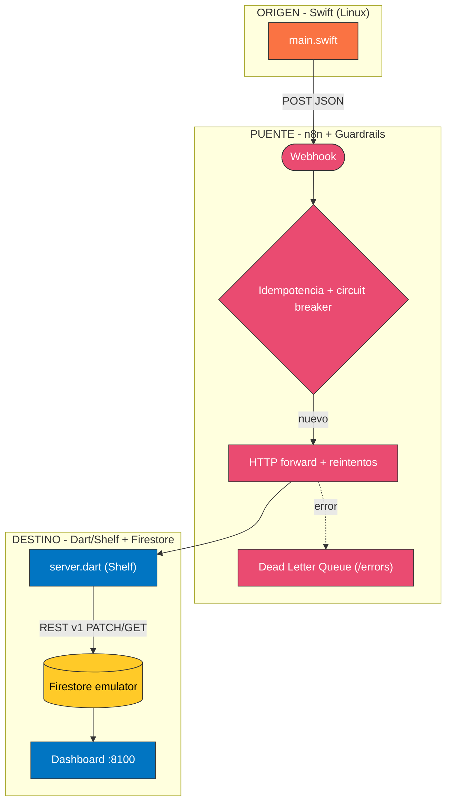
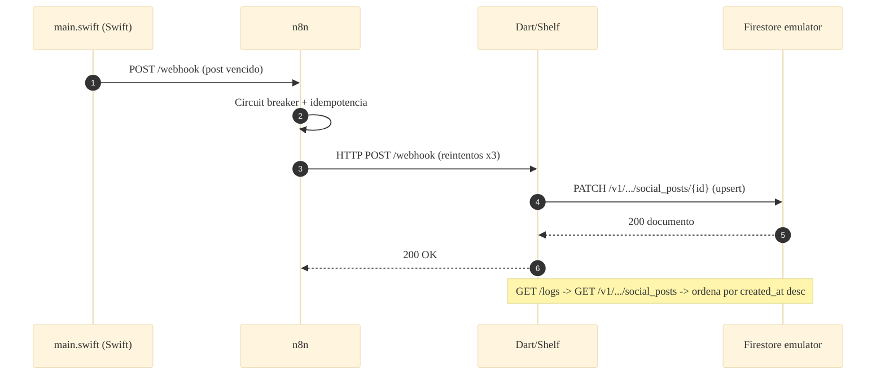

# 📐 Arquitectura — Caso 20: 🍎 Swift → 🌉 n8n → 🎯 Dart (Shelf) + 🔥 Firestore emulator

[](https://www.swift.org/)
[](https://dart.dev/)
[](https://firebase.google.com/docs/emulator-suite)
[](https://n8n.io/)

> Stack mobile-backend server-side: emisor **Swift** (Linux) y receptor **Dart/Shelf** que persiste en el **emulador de Firestore** vía su API REST v1. Firebase local, sin nube.

---

## 🧭 Ficha técnica

| Atributo | Valor |
| :--- | :--- |
| **ID** | `20` |
| **Origen** | Swift (Linux) — [`origin/Sources/Publisher/main.swift`](origin/Sources/Publisher/main.swift) |
| **Puente** | n8n — [`case-20-swift-to-dart.json`](../../n8n/workflows/case-20-swift-to-dart.json) |
| **Destino** | Dart / Shelf (AOT) — [`dest/bin/server.dart`](dest/bin/server.dart) |
| **Persistencia** | Firestore (Firebase Emulator Suite) |
| **Puerto (dashboard)** | [`http://localhost:8100`](http://localhost:8100) |
| **Perfil Docker** | `case20` |

---

## 🗺️ Diagrama de arquitectura



---

## 🔁 Diagrama de secuencia (ciclo de una publicación)



---

## 🧩 Componentes

### 🍎 Origen — Swift (Linux)

- `origin/Sources/Publisher/main.swift` reenvía los posts vencidos a n8n con `URLSession` (Foundation). Swift Package Manager, binario nativo.

### 🌉 Puente — n8n

- Guardrails canónicos: fingerprint → circuit breaker → idempotencia → HTTP forward con reintentos → DLQ.

### 🎯 Destino — Dart/Shelf + Firestore

- `dest/bin/server.dart` (Shelf, compilado AOT) traduce el contrato REST a la API REST v1 de Firestore: `PATCH` para upsert, `GET` para listar. Documentos con `fields` tipados.

---

## ▶️ Cómo levantarlo

```bash
docker-compose --profile case20 up -d          # emulador Firestore + receptor Dart
```

Dashboard: [`http://localhost:8100`](http://localhost:8100)

---

## 🔗 Enlaces

- 📄 [README del caso](README.md)
- 🗺️ [Arquitectura global del laboratorio](../../docs/ARCHITECTURE.md)
- 🛡️ [Guardrails de resiliencia](../../docs/GUARDRAILS.md)
- 🧩 [Índice de casos](../../docs/CASES_INDEX.md)

---

*Diagramas en [Mermaid](https://mermaid.js.org/) — se renderizan nativamente en GitHub. Parte de **Social Bot Scheduler**.*
