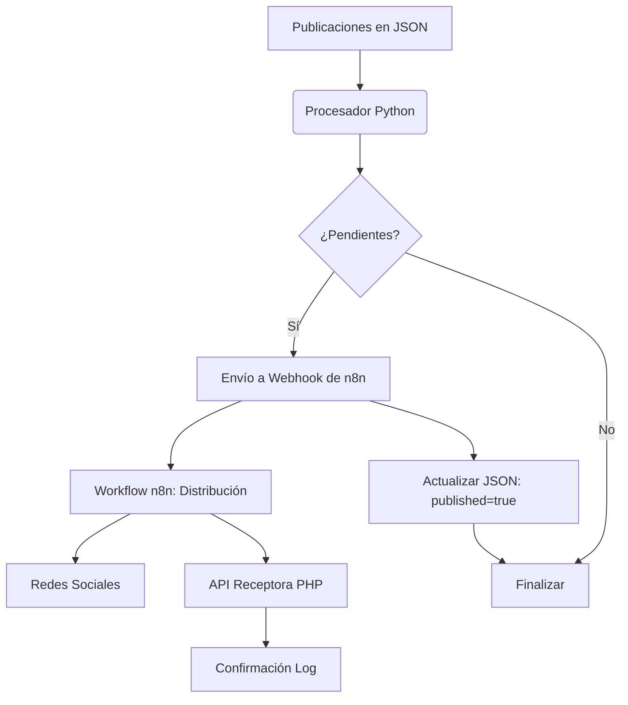

# 🏗️ Arquitectura del Sistema

El **Social Bot Scheduler** está diseñado con un enfoque modular y orientado a servicios para facilitar la automatización de redes sociales.

## Diagrama de Flujo de Datos (Mermaid)

## Componentes del Sistema

### 1. Capa de Datos (JSON)
Representada por el archivo `posts.json`. Es una base de datos documental ligera que permite definir el contenido, el tiempo y los destinos de cada publicación.

### 2. Núcleo (Python)
El script actúa como el motor de orquestación. Realiza la validación de esquemas, comparación de marcas de tiempo y gestión de peticiones hacia el orquestador.

### 3. Capa de Automatización (n8n)
La pieza central de la distribución. Recibe el payload de Python y, mediante nodos visuales, reparte la publicación a múltiples APIs (Twitter, Slack, etc.) y envía un reporte a la API de logs.

### 4. Capa de Recepción (PHP)
Un receptor ligero diseñado para ejecutarse en cualquier servidor web. Captura los eventos finales de publicación para auditoría y persistencia de logs históricos.

## Estrategia de Despliegue
- **Local**: Ejecución directa vía script.
- **Contenedores**: Empaquetado vía Docker para ambientes de testing.
- **Nube**: Orquestación vía Kubernetes para alta disponibilidad y escalabilidad.
