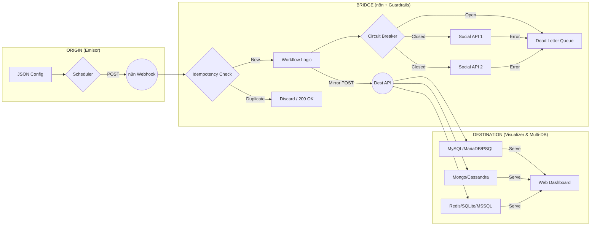
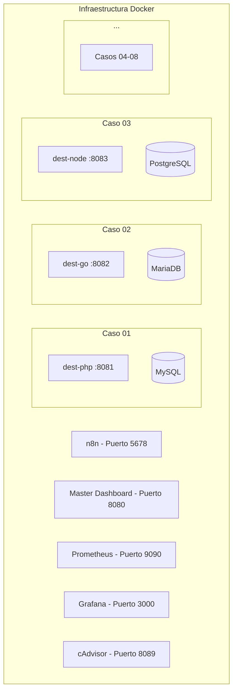
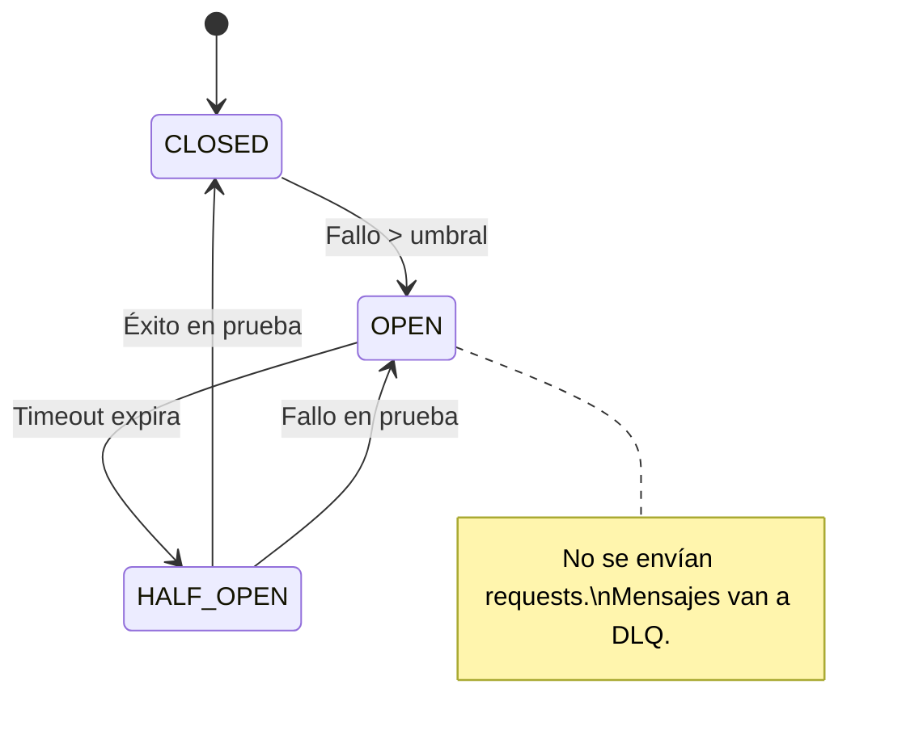
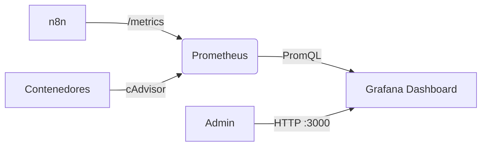
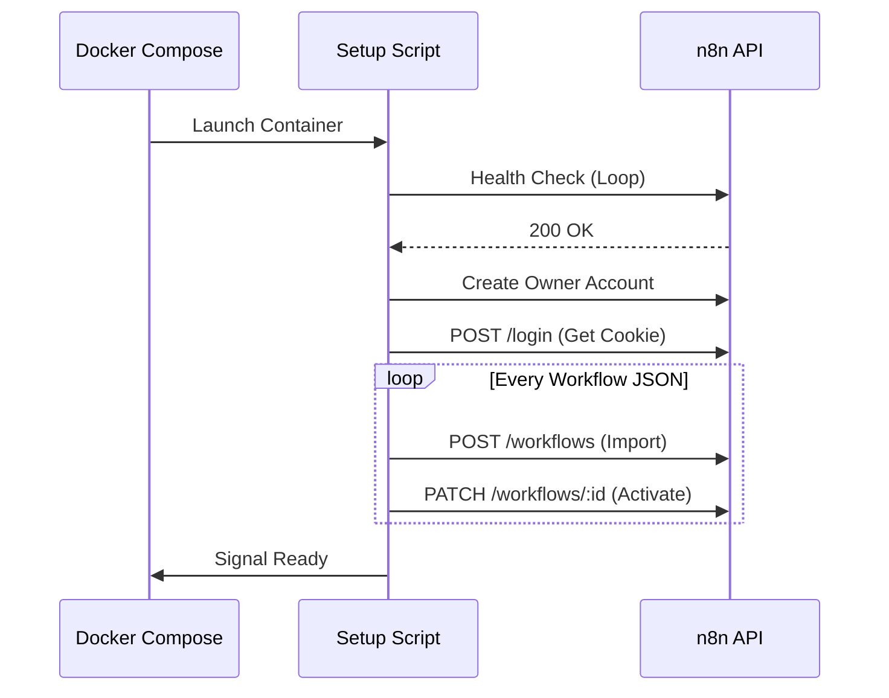
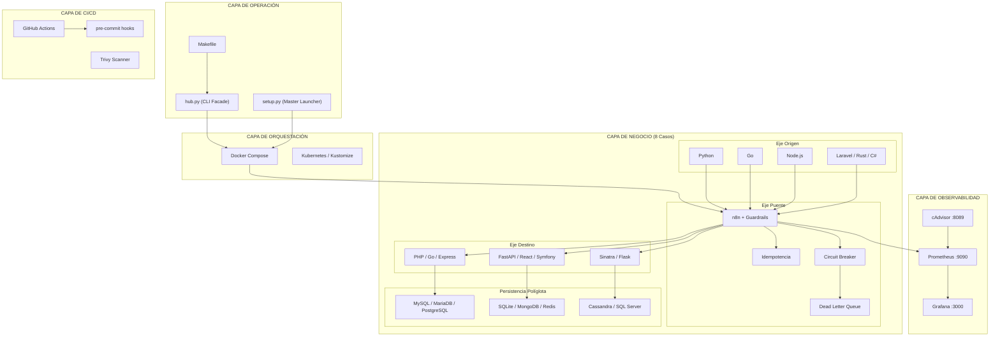

# 🏗️ Arquitectura del Social Bot Scheduler

El **Social Bot Scheduler** ha evolucionado hacia una infraestructura de **Matriz Tecnológica**. No es un solo producto, sino un ecosistema modular donde puedes intercambiar piezas de software según tus necesidades.

Este documento cataloga los **11 patrones arquitectónicos** identificados en el sistema, explicando dónde se aplican y por qué.

---

## 📐 Los 3 Ejes Fundamentales

### 1. Eje de Origen (Emisores)
Es el componente que posee la **lógica de programación**. Revisa el archivo `posts.json`, valida las fechas y "dispara" el evento hacia el puente.
- **Implementaciones**: Python (Pydantic), Go (Native), Node.js (Axios), Laravel (Artisan), Rust (reqwest), C# (.NET HttpClient).

### 2. Eje del Puente (n8n + Guardrails)
Es la **capa de abstracción y resiliencia**. Recibe un Webhook genérico y asegura que la entrega a redes sociales sea segura.
- **Ventaja**: El emisor no necesita conocer las APIs de las redes sociales.
- **Guardrails**: Implementa **Idempotencia** (evita duplicados), **Circuit Breakers** (protección contra caídas de proveedores) y **DLQ** (cola de errores para reintentos).

### 3. Eje de Destino (Receptores + Dashboards + Persistencia Políglota)
Es la **capa de auditoría y visualización**. n8n envía una copia del post finalizado a estos servicios para que el usuario pueda ver el historial en un navegador.
- **Implementaciones**: PHP (Apache), Go, Node.js (Express), FastAPI, React (Node API), Symfony, Ruby (Sinatra), Flask.
- **Persistencia**: Cada destino orquesta su propio motor de base de datos (MySQL, PostgreSQL, MongoDB, Cassandra, etc.), demostrando la capacidad de manejar diversos paradigmas de datos.

---

## 📊 Matriz de Casos Implementados

| Caso | Origen | Puente | Destino | Base de Datos | Puerto |
| :--- | :--- | :--- | :--- | :--- | :--- |
| **01** | Python | n8n | PHP Vanilla | **MySQL** | 8081 |
| **02** | Python | n8n | Go | **MariaDB** | 8082 |
| **03** | Go | n8n | Node / Express | **PostgreSQL** | 8083 |
| **04** | Node.js | n8n | Python FastAPI | **SQLite** | 8084 |
| **05** | Laravel | n8n | React / Node | **MongoDB** | 8085 |
| **06** | Go | n8n | Symfony | **Redis** | 8086 |
| **07** | Rust | n8n | Ruby (Sinatra) | **Cassandra** | 8087 |
| **08** | C# (.NET) | n8n | Flask | **SQL Server** | 8088 |

---

## 🔄 Diagrama de Flujo Universal



---

## 🧬 Catálogo de Patrones Arquitectónicos

A continuación se detallan los **11 patrones** que conforman la arquitectura del sistema.

---

### Patrón 1: Microservices Architecture

**Descripción**: El sistema se descompone en servicios independientes, cada uno ejecutándose en su propio contenedor Docker con su propio proceso, runtime y base de datos.

**Evidencia en el código**:
- `docker-compose.yml` define **~20 servicios**: 8 destinos, 8 bases de datos, n8n, Prometheus, Grafana, cAdvisor y Master Dashboard.
- Cada servicio tiene su propia imagen Docker, límites de CPU/RAM (`deploy.resources`), y red compartida (`bot-network`).
- Los perfiles Docker Compose (`profiles: ["case01", "full"]`) permiten levantar subconjuntos de servicios según necesidad.

**Por qué importa**: Permite escalar, desplegar y fallar de forma independiente cada componente. Un error en el destino Go (Caso 02) no afecta al destino PHP (Caso 01).



---

### Patrón 2: Event-Driven / Webhook Architecture

**Descripción**: Toda la comunicación entre Origen → Puente → Destino se basa en **eventos HTTP asíncronos (webhooks)**. No hay acoplamiento directo entre emisores y receptores.

**Evidencia en el código**:
- Los emisores (en `cases/*/origin/`) realizan un `POST` HTTP a una URL de webhook de n8n.
- n8n procesa el evento y, como efecto secundario, envía un `POST` al servicio de destino ("Mirror POST").
- El emisor NO conoce la existencia del receptor. Solo conoce la URL del webhook.

**Por qué importa**: Desacoplamiento total. Puedes cambiar el destino de PHP a Go sin modificar una sola línea en el emisor Python.

---

### Patrón 3: Mediator / Hub-and-Spoke

**Descripción**: n8n actúa como un **mediador central** (spoke) al que todos los flujos convergen y desde el cual divergen. Ningún componente se comunica directamente con otro; todo pasa por el puente.

**Evidencia en el código**:
- Los 8 workflows en `n8n/workflows/` definen las rutas de cada caso.
- `hub.py` actúa como un segundo mediador a nivel CLI, orquestando Docker, ejecución de casos y diagnósticos desde un solo punto de entrada.
- `setup.py` (Master Launcher) configura las variables de entorno para enrutar correctamente cada caso.

**Por qué importa**: Centraliza la lógica de enrutamiento, transformación y control. Para agregar un nuevo caso, solo hay que crear un nuevo workflow en n8n.

---

### Patrón 4: Three-Tier Pipeline (Origen → Puente → Destino)

**Descripción**: Patrón propio del proyecto que estructura cada caso como un pipeline de 3 capas con responsabilidades claramente separadas.

| Capa | Responsabilidad | Componentes |
| :--- | :--- | :--- |
| **Origen** | Programación temporal, lectura de `posts.json`, disparo del evento | Python, Go, Node.js, Laravel, Rust, C# |
| **Puente** | Recepción, validación, resiliencia, despacho a redes sociales | n8n + Guardrails |
| **Destino** | Persistencia de auditoría, visualización web en dashboard | PHP, Go, Express, FastAPI, React, Symfony, Sinatra, Flask |

**Evidencia en el código**:
- Estructura de carpetas: `cases/XX-origin-to-dest/origin/` y `cases/XX-origin-to-dest/dest/`
- `app.manifest.yml` en cada caso describe formalmente los componentes de origen y destino.
- La documentación y configuración refuerzan esta separación en 3 ejes.

---

### Patrón 5: Polyglot Persistence (Persistencia Políglota)

**Descripción**: Cada servicio de destino almacena datos en un motor de base de datos **diferente**, cubriendo los principales paradigmas de almacenamiento de la industria.

| Motor | Caso | Paradigma | Imagen Docker | Uso típico en la industria |
| :--- | :--- | :--- | :--- | :--- |
| **MySQL** | 01 | Relacional | `mysql:8.0-oracle` | Aplicaciones web tradicionales |
| **MariaDB** | 02 | Relacional | `mariadb:10.11` | Fork de MySQL, alta compatibilidad |
| **PostgreSQL** | 03 | Relacional avanzado | `postgres:15-alpine` | Datos geoespaciales, JSON nativo |
| **SQLite** | 04 | Embebido / archivo | *(incluido en Python)* | Apps móviles, prototipos, edge |
| **MongoDB** | 05 | Documental (NoSQL) | `mongo:6.0` | Catálogos, datos semi-estructurados |
| **Redis** | 06 | Clave-Valor (In-Memory) | `redis:7-alpine` | Caché, sesiones, colas |
| **Cassandra** | 07 | Columnar distribuido | `cassandra:4.1` | Escrituras masivas, IoT, time-series |
| **SQL Server** | 08 | Relacional enterprise | `mssql/server:2022-latest` | Ecosistemas corporativos Microsoft |

**Por qué importa**: Demuestra que la arquitectura puede operar con cualquier motor de datos sin que el puente (n8n) necesite saber qué base usa cada destino. Cada receptor es dueño de su propia persistencia.

---

### Patrón 6: Resilience Patterns (Patrones de Resiliencia)

**Descripción**: El sistema implementa 3 patrones de resiliencia estándar de la industria para protegerse contra fallos en cascada.

#### 6.1 Idempotency (Idempotencia)

- **Archivo**: `scripts/check_idempotency.py`
- **Mecanismo**: Cada post enviado lleva un hash único. Si n8n recibe un POST con un hash ya procesado, lo descarta con `200 OK`.
- **Beneficio**: Evita publicaciones duplicadas ante reintentos o doble-clic.

#### 6.2 Circuit Breaker (Disyuntor)

- **Archivo**: `scripts/circuit_breaker.py`
- **Mecanismo**: Monitorea la tasa de fallos contra las APIs de redes sociales. Si los errores superan un umbral, el circuito se "abre" y deja de intentar, previniendo saturar un servicio ya caído.
- **Estados**: `CLOSED` (normal) → `OPEN` (fallando, no reintentar) → `HALF-OPEN` (probando recuperación).

#### 6.3 Dead Letter Queue (Cola de Mensajes Muertos)

- **Implementación**: Dentro de los workflows de n8n.
- **Mecanismo**: Los mensajes que fallan repetidamente (tras agotar reintentos) se derivan a una cola especial (DLQ) para inspección manual posterior.
- **Beneficio**: Ningún mensaje se pierde silenciosamente.



---

### Patrón 7: Observability Stack (Stack de Observabilidad)

**Descripción**: Pipeline de telemetría estándar CNCF con 3 componentes: generación, almacenamiento y visualización de métricas.

#### Flujo de Datos
1. **Generación**: n8n (y contenedores) exponen métricas en formato texto plano en `/metrics`.
2. **Scraping (Pull)**: Prometheus "hala" (scrapes) estos datos cada 15 segundos.
3. **Almacenamiento**: Prometheus guarda las series temporales en su TSDB local.
4. **Visualización**: Grafana consulta a Prometheus (vía PromQL) para pintar los gráficos.

**Evidencia en el código**:
- `prometheus/prometheus.yml` — configuración de scraping targets.
- `grafana/provisioning/` — dashboards y datasources preconfigurados.
- cAdvisor expone métricas de consumo de cada contenedor (CPU, RAM, red, disco).



---

### Patrón 8: Infrastructure as Code (IaC)

**Descripción**: Toda la infraestructura se define de forma declarativa en archivos versionados, eliminando configuraciones manuales.

| Componente | Archivo(s) | Función |
| :--- | :--- | :--- |
| **Docker Compose** | `docker-compose.yml`, `docker-compose.dev.yml` | Definición de 20+ servicios, redes, volúmenes y límites de recursos |
| **Kubernetes** | `k8s/base/` (configmap, cronjob, network-policy, kustomization) | Manifiestos para despliegue en clúster con Kustomize |
| **K8s Overlays** | `k8s/overlays/` | Variantes por entorno (prod, staging) |
| **n8n Auto-Setup** | `scripts/n8n_auto_setup.sh` | Importación y activación programática de workflows |
| **Prometheus** | `prometheus/prometheus.yml` | Targets de scraping declarativos |
| **Grafana** | `grafana/provisioning/` | Dashboards y datasources como código |

**Por qué importa**: Permite reconstruir todo el entorno desde cero con un solo `docker-compose up -d`. Nada vive "solo en la UI".

---

### Patrón 9: Multi-Stage Docker Build + Security Hardening

**Descripción**: El `Dockerfile` principal implementa buenas prácticas de seguridad y optimización de imágenes.

#### Multi-Stage Build
```
Stage 1 (builder):  python:3.11-slim + gcc → compila dependencias
Stage 2 (final):    python:3.11-slim → solo runtime, sin herramientas de compilación
```

#### Hardening de Seguridad
| Práctica | Implementación |
| :--- | :--- |
| **Usuario no-root** | Se crea `botuser:botgroup` y el contenedor ejecuta con `USER botuser` |
| **Imagen slim** | `python:3.11-slim-bookworm` minimiza superficie de ataque |
| **Healthcheck** | Verifica que `hub.py` exista y sea accesible |
| **No bytecode** | `PYTHONDONTWRITEBYTECODE=1` evita archivos `.pyc` innecesarios |
| **Buffered output** | `PYTHONUNBUFFERED=1` asegura logs en tiempo real |

---

### Patrón 10: CLI Facade Pattern (hub.py)

**Descripción**: `hub.py` actúa como una **fachada** (Facade) que abstrae toda la complejidad operativa del sistema detrás de comandos simples.

#### Comandos disponibles

| Comando | Descripción | Función interna |
| :--- | :--- | :--- |
| `listar-casos` | Enumera los 8 casos con su stack tecnológico | `listar_casos()` |
| `ejecutar <caso>` | Lanza un caso con validación de seguridad | `ejecutar_caso()` |
| `doctor` | Diagnóstico de salud del entorno | `ejecutar_doctor()` |
| `up [--full]` | Levanta infraestructura Docker | `gestionar_stack()` |
| `down` | Detiene los contenedores | `gestionar_stack()` |
| `clean` | Limpieza profunda de Docker | `limpiar_todo()` |

#### Mecanismos de seguridad integrados
- **Whitelist de caracteres**: `re.match(r"^[a-zA-Z0-9_\-]+$", nombre_caso)` previene inyección de comandos.
- **Prevención de Path Traversal**: Verifica que la ruta resuelta siga dentro de `CASES_DIR`.
- **Audit Trail**: Cada acción se registra en `hub.audit.log` con timestamp, usuario, comando y resultado.
- **Modo Dry-Run por defecto**: El flag `--real` es necesario para ejecutar acciones persistentes; por defecto todo es simulación.

---

### Patrón 11: CI/CD Pipeline

**Descripción**: El repositorio implementa integración y despliegue continuo mediante GitHub Actions.

**Archivos**:
- `.github/workflows/ci-cd.yml` — Pipeline principal de CI/CD (lint, tests, security, build).
- `.github/workflows/wiki-sync.yml` — Sincronización automática de documentación hacia la Wiki.

**Herramientas integradas**:
| Herramienta | Propósito |
| :--- | :--- |
| **Black** | Formateo automático de código Python |
| **pip-audit** | Auditoría de vulnerabilidades en dependencias |
| **Trivy** | Escaneo de vulnerabilidades en imágenes Docker |
| **pre-commit** | Hooks de validación antes de cada commit (`.pre-commit-config.yaml`) |

---

## ⚙️ Automatización Zero-Touch (n8n Auto-Setup)

Para facilitar el despliegue, el contenedor de n8n utiliza un entrypoint personalizado (`scripts/n8n_auto_setup.sh`) que realiza las siguientes acciones al primer arranque:

1. **Polling de Salud**: Espera a que la API de n8n esté disponible.
2. **Configuración de Admin**: Crea automáticamente la cuenta `admin@social-bot.local`.
3. **Importación REST**: Autentica y utiliza la API de n8n para importar los 8 archivos JSON desde `n8n/workflows/`.
4. **Activación Forzada**: Activa cada flujo individualmente para que los Webhooks queden registrados.

Este proceso elimina la necesidad de configuración manual de la UI, permitiendo un flujo de trabajo "Infrastructure as Code" para las automatizaciones visuales.



---

## 🚀 Despliegue y Escalabilidad

Cada caso es independiente pero comparte el mismo "Puente" (n8n). El **Master Launcher** (`setup.py`) orquesta la configuración de variables de entorno para asegurar que el emisor de un caso hable con el receptor del mismo caso sin conflictos de red.

El despliegue soporta múltiples estrategias:
- **Local**: `docker-compose up -d` (o `make up` para el stack completo).
- **Kubernetes**: `kubectl apply -k k8s/overlays/prod/` (o `make deploy`).
- **Selectivo**: Perfiles Docker Compose (`--profile case01`) para levantar solo un caso.

---

## 🧭 Diagrama de Arquitectura Completa



---

## 📋 Tabla Resumen de Patrones

| # | Categoría | Patrón | Evidencia Principal |
| :--- | :--- | :--- | :--- |
| 1 | Estructura | **Microservices** | `docker-compose.yml` (20+ servicios) |
| 2 | Comunicación | **Event-Driven / Webhooks** | n8n como broker HTTP |
| 3 | Coordinación | **Mediator / Hub-and-Spoke** | n8n + `hub.py` |
| 4 | Flujo | **Three-Tier Pipeline** | Origen → Puente → Destino |
| 5 | Datos | **Polyglot Persistence** | 8 motores de BD distintos |
| 6 | Resiliencia | **Circuit Breaker + Idempotency + DLQ** | `scripts/circuit_breaker.py`, `scripts/check_idempotency.py` |
| 7 | Observabilidad | **Prometheus + Grafana + cAdvisor** | Stack CNCF completo |
| 8 | Infraestructura | **Infrastructure as Code** | Docker Compose + K8s + auto-setup |
| 9 | Seguridad | **Multi-Stage Build + Hardening** | `Dockerfile` (non-root, slim, healthcheck) |
| 10 | Operación | **CLI Facade** | `hub.py` (6 comandos, audit trail, validación) |
| 11 | Entrega | **CI/CD Pipeline** | GitHub Actions + pre-commit + Trivy |
