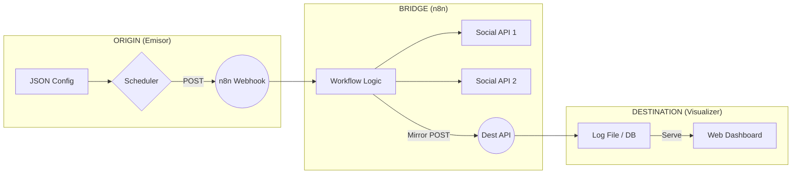

# 🏗️ Arquitectura de "3 Ejes": Origen ➔ Puente ➔ Destino

El **Social Bot Scheduler** ha evolucionado hacia una infraestructura de **Matriz Tecnológica**. No es un solo producto, sino un ecosistema modular donde puedes intercambiar piezas de software según tus necesidades.

---

## 📐 Los 3 Ejes Fundamentales

### 1. Eje de Origen (Emisores)
Es el componente que posee la **lógica de programación**. Revisa el archivo `posts.json`, valida las fechas y "dispara" el evento hacia el puente.
- **Implementaciones**: Python (Pydantic), Go (Native), Node.js (Axios), Laravel (Artisan).

### 2. Eje del Puente (n8n)
Es la **capa de abstracción**. Recibe un Webhook genérico y lo transforma en acciones reales sobre redes sociales (X, Facebook, Slack, etc.). 
- **Ventaja**: El emisor no necesita conocer las APIs de las redes sociales, solo sabe hablar con n8n.

### 3. Eje de Destino (Receptores + Dashboards)
Es la **capa de auditoría y visualización**. n8n envía una copia del post finalizado a estos servicios para que el usuario pueda ver el historial en un navegador.
- **Implementaciones**: PHP (Apache), Go, Node.js (Express), FastAPI, React (Node API), Symfony.

---

## 📊 Matriz de Casos Implementados

| Caso | Origen | Puente | Destino | Dashboard Port |
| :--- | :--- | :--- | :--- | :--- |
| **01** | Python | n8n | PHP Vanilla | 8081 |
| **02** | Python | n8n | Go | 8082 |
| **03** | Go | n8n | Node / Express | 8083 |
| **04** | Node.js | n8n | Python FastAPI | 8084 |
| **05** | Laravel | n8n | React / Node | 8085 |
| **06** | Go | n8n | Symfony | 8086 |
| **07** | Rust | n8n | Ruby (Sinatra) | 8087 |
| **08** | C# (.NET) | n8n | Flask | 8088 |

---

## 🔄 Diagrama de Flujo Universal

---

## 🚀 Despliegue y Escalabilidad
Cada caso es independiente pero comparte el mismo "Puente" (n8n). El **Master Launcher** (`setup.py`) orquesta la configuración de variables de entorno para asegurar que el emisor de un caso hable con el receptor del mismo caso sin conflictos de red.
