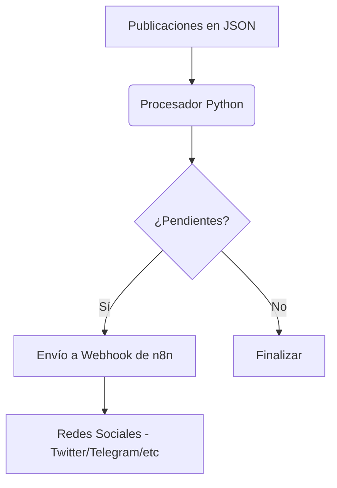

# 🏗️ Arquitectura del Sistema

El **Social Bot Scheduler** está diseñado con un enfoque modular y orientado a servicios para facilitar la automatización de redes sociales.

## Diagrama de Flujo de Datos (Mermaid)

## Componentes del Sistema

### 1. Capa de Datos (JSON)
Representada por el archivo `posts.json`. Es una base de datos documental ligera que permite definir el contenido, el tiempo y los destinos de cada publicación.

### 2. Núcleo (Python)
El script `bot.py` actúa como el motor de orquestación. Realiza las siguientes tareas:
- Validación de esquemas.
- Comparación de marcas de tiempo (Time-checking).
- Gestión de peticiones HTTP con reintentos.

### 3. Capa de Integración (Webhook)
El sistema no publica directamente en las APIs de redes sociales. En su lugar, delega la lógica de distribución a **n8n** a través de webhooks REST, lo que permite una mayor flexibilidad sin cambiar el código del bot.

## Estrategia de Despliegue
- **Local**: Ejecución directa vía script.
- **Contenedores**: Empaquetado vía Docker para ambientes de testing.
- **Nube**: Orquestación vía Kubernetes para alta disponibilidad y escalabilidad.
