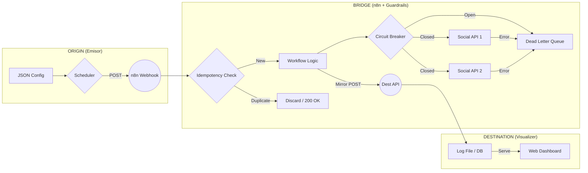
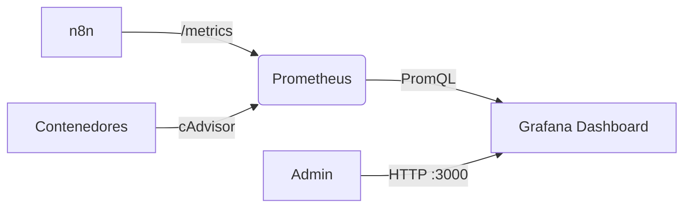
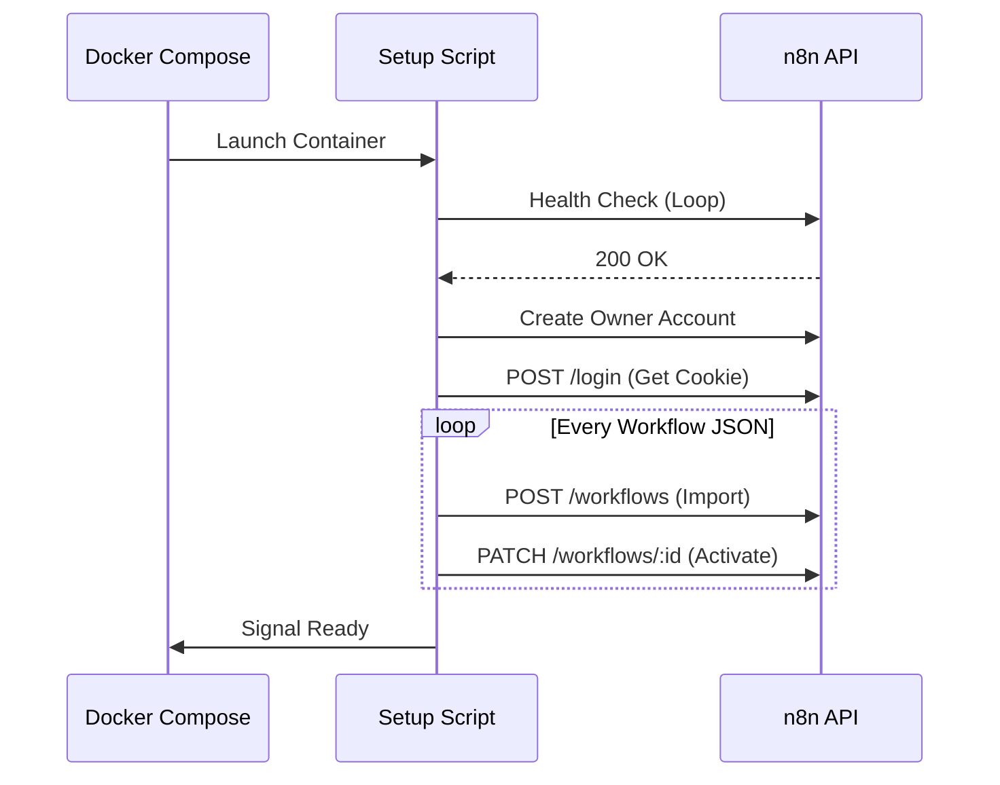

# 🏗️ Arquitectura de "3 Ejes": Origen ➔ Puente ➔ Destino

El **Social Bot Scheduler** ha evolucionado hacia una infraestructura de **Matriz Tecnológica**. No es un solo producto, sino un ecosistema modular donde puedes intercambiar piezas de software según tus necesidades.

---

## 📐 Los 3 Ejes Fundamentales

### 1. Eje de Origen (Emisores)
Es el componente que posee la **lógica de programación**. Revisa el archivo `posts.json`, valida las fechas y "dispara" el evento hacia el puente.
- **Implementaciones**: Python (Pydantic), Go (Native), Node.js (Axios), Laravel (Artisan).

### 2. Eje del Puente (n8n + Guardrails)
Es la **capa de abstracción y resiliencia**. Recibe un Webhook genérico y asegura que la entrega a redes sociales sea segura.
- **Ventaja**: El emisor no necesita conocer las APIs de las redes sociales.
- **Guardrails**: Implementa **Idempotencia** (evita duplicados), **Circuit Breakers** (protección contra caídas de proveedores) y **DLQ** (cola de errores para reintentos).

### 3. Eje de Destino (Receptores + Dashboards)
Es la **capa de auditoría y visualización**. n8n envía una copia del post finalizado a estos servicios para que el usuario pueda ver el historial en un navegador.
- **Implementaciones**: PHP (Apache), Go, Node.js (Express), FastAPI, React (Node API), Symfony.

---

## 📊 Matriz de Casos Implementados

| Caso | Origen | Puente | Destino | Dashboard Port |
| :--- | :--- | :--- | :--- | :--- |
| **01** | Python | n8n | PHP Vanilla | 8081 |
| **02** | Python | n8n | Go | 8082 |
| **03** | Go | n8n | Node / Express | 8083 |
| **04** | Node.js | n8n | Python FastAPI | 8084 |
| **05** | Laravel | n8n | React / Node | 8085 |
| **06** | Go | n8n | Symfony | 8086 |
| **07** | Rust | n8n | Ruby (Sinatra) | 8087 |
| **08** | C# (.NET) | n8n | Flask | 8088 |

---

## 🔄 Diagrama de Flujo Universal

---

## 🚀 Despliegue y Escalabilidad
Cada caso es independiente pero comparte el mismo "Puente" (n8n). El **Master Launcher** (`setup.py`) orquesta la configuración de variables de entorno para asegurar que el emisor de un caso hable con el receptor del mismo caso sin conflictos de red.

## 📡 Capa de Observabilidad

El sistema no opera a ciegas. Hemos integrado un pipeline de telemetría estándar de la industria.

### Flujo de Datos
1.  **Generación**: n8n (y contenedores) exponen métricas en formato texto plano en `/metrics`.
2.  **Scraping (Pull)**: Prometheus "hala" (scrapes) estos datos cada 15 segundos.
3.  **Almacenamiento**: Prometheus guarda las series temporales en su TSDB local.
4.  **Visualización**: Grafana consulta a Prometheus (vía PromQL) para pintar los gráficos.

## ⚙️ Automatización Zero-Touch (n8n Auto-Setup)

Para facilitar el despliegue, el contenedor de n8n utiliza un entrypoint personalizado (`scripts/n8n_auto_setup.sh`) que realiza las siguientes acciones al primer arranque:

1.  **Polling de Salud**: Espera a que la API de n8n esté disponible.
2.  **Configuración de Admin**: Crea automáticamente la cuenta `admin@social-bot.local`.
3.  **Importación REST**: Autentica y utiliza la API de n8n para importar los 8 archivos JSON desde `n8n/workflows/`.
4.  **Activación Forzada**: Activa cada flujo individualmente para que los Webhooks queden registrados.

Este proceso elimina la necesidad de configuración manual de la UI, permitiendo un flujo de trabajo "Infrastructure as Code" para las automatizaciones visuales.

