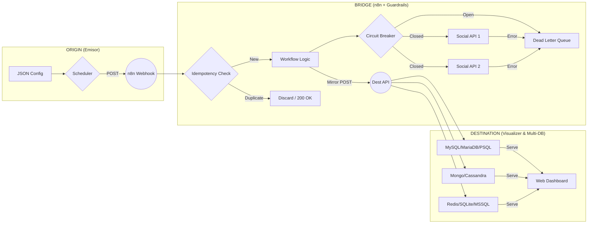
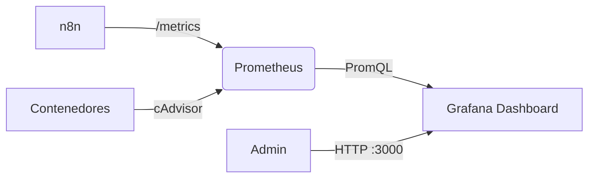

# 🏗️ Arquitectura del Social Bot Scheduler

El **Social Bot Scheduler** ha evolucionado hacia una infraestructura de **Matriz Tecnológica**. No es un solo producto, sino un ecosistema modular donde puedes intercambiar piezas de software según tus necesidades.

---

## 📐 Los 3 Ejes Fundamentales

### 1. 📤 Eje de Origen (Emisores)
Es el componente que posee la **lógica de programación**. Revisa el archivo `posts.json`, valida las fechas y "dispara" el evento hacia el puente.
- **Implementaciones**: Python (Pydantic), Go (Native), Node.js (Axios), Laravel (Artisan), Rust (reqwest), C# (.NET HttpClient).

### 2. 🌉 Eje del Puente (n8n + Guardrails)
Es la **capa de abstracción y resiliencia**. Recibe un Webhook genérico y asegura que la entrega a redes sociales sea segura.
- **Ventaja**: El emisor no necesita conocer las APIs de las redes sociales.
- **Guardrails**: Implementa **Idempotencia** (evita duplicados), **Circuit Breakers** (protección contra caídas) y **DLQ** (cola de errores).

### 3. 📥 Eje de Destino (Receptores + Dashboards)
Es la **capa de auditoría y visualización**. n8n envía una copia del post finalizado a estos servicios.
- **Implementaciones**: PHP, Go, Node.js, FastAPI, React, Symfony, Ruby, Flask.
- **Persistencia**: Cada destino orquesta su propio motor de base de datos (MySQL, PostgreSQL, MongoDB, Cassandra, etc.).

---

## 🧩 Matriz de Casos Implementados

| Caso | Origen | Puente | Destino | Base de Datos | Puerto |
| :--- | :--- | :--- | :--- | :--- | :--- |
| **01** | Python | n8n | PHP Vanilla | 🐬 **MySQL** | 8081 |
| **02** | Python | n8n | Go | 🍃 **MariaDB** | 8082 |
| **03** | Go | n8n | Node / Express | 🐘 **PostgreSQL** | 8083 |
| **04** | Node.js | n8n | Python FastAPI | 📂 **SQLite** | 8084 |
| **05** | Laravel | n8n | React / Node | 🍃 **MongoDB** | 8085 |
| **06** | Go | n8n | Symfony | 🏎️ **Redis** | 8086 |
| **07** | Rust | n8n | Ruby (Sinatra) | 👁️ **Cassandra** | 8087 |
| **08** | C# (.NET) | n8n | Flask | 🏢 **SQL Server** | 8088 |
| **09** | Python | n8n | FastAPI Gateway | 🦆 **DuckDB** | 8090 |

---

## 🔄 Diagrama de Flujo Universal

```mermaid
graph LR
    subgraph "ORIGIN (Emisor)"
        A[JSON Config] --> B{Scheduler}
        B -- POST --> C((n8n Webhook))
    end

    subgraph "BRIDGE (n8n + Guardrails)"
        C((n8n Webhook)) --> CM{Idempotency Check}
        CM -- New --> D[Workflow Logic]
        CM -- Duplicate --> C1[Discard / 200 OK]
        D --> CB{Circuit Breaker}
        CB -- Closed --> E[Social API 1]
        CB -- Closed --> F[Social API 2]
        CB -- Open --> DLQ[Dead Letter Queue]
        E & F -- Error --> DLQ
        D -- Mirror POST --> G((Dest API))
    end

    subgraph "DESTINATION (Visualizer & Multi-DB)"
        G --> H1[MySQL/MariaDB/PSQL]
        G --> H2[Mongo/Cassandra]
        G --> H3[Redis/SQLite/MSSQL]
        H1 & H2 & H3 -- Serve --> I[Web Dashboard]
    end
```

---

## 🧬 Catálogo de Patrones Arquitectónicos

> [!TIP]
> Estos patrones son los pilares que permiten que el sistema sea escalable y políglota.

### 1. 🏗️ Microservices Architecture
El sistema se descompone en servicios independientes, cada uno en su propio contenedor Docker.
- **Evidencia**: `docker-compose.yml` define **~20 servicios**.
- **Beneficio**: Aislamiento total. Un fallo en el Caso 02 no afecta al resto.

### 2. ⚡ Event-Driven / Webhooks
Comunicación basada en eventos HTTP asíncronos.
- **Evidencia**: Emisores en `cases/*/origin/` disparan hacia URLs de n8n.
- **Beneficio**: Desacoplamiento total entre emisor y receptor.

### 3. 🕸️ Mediator / Hub-and-Spoke
n8n actúa como el mediador central (Hub) donde convergen todos los flujos.
- **Por qué importa**: Centraliza la lógica de transformación y permite añadir casos sin tocar código existente.

### 4. 🛡️ Resilience Patterns (Circuit Breaker & Idempotency)
El sistema protege activamente la integridad de los datos y la salud de los proveedores externos.
- **Idempotencia**: `scripts/check_idempotency.py` evita duplicados.
- **Disyuntor**: `scripts/circuit_breaker.py` previene saturación ante fallos externos.

---

## 📊 Observabilidad CNCF

El stack implementa el estándar industrial de monitoreo:

```mermaid
graph LR
    A[n8n] -- /metrics --> B(Prometheus)
    C[Contenedores] -- cAdvisor --> B
    B -- PromQL --> D[Grafana Dashboard]
    E[Admin] -- HTTP :3000 --> D
```

> [!IMPORTANT]
> Prometheus realiza "scraping" cada 15 segundos para mantener datos frescos sin saturar el runtime.

---

## 🚀 Despliegue y Escalabilidad

El despliegue soporta múltiples entornos:
- **Local (Secure-default)**: `make up-secure`.
- **Kubernetes**: Manifiestos en `k8s/base/` listos para Kustomize.
- **Edge Deployment**: Perfil `make up-edge` con proxy Caddy.

---

## 📋 Tabla Resumen de Patrones

| # | Categoría | Patrón | Implementación Principal |
| :--- | :--- | :--- | :--- |
| 1 | Estructura | **Microservices** | 20+ Contenedores Docker |
| 2 | Comunicación | **Webhooks** | n8n HTTP Broker |
| 3 | Datos | **Polyglot Persistence** | 9 Motores de BD distintos |
| 4 | Resiliencia | **Guardrails** | Circuit Breaker & Idempotency |
| 5 | Operación | **CLI Facade** | `hub.py` Management Hub |

---

*Arquitectura diseñada para la resiliencia por Vladimir Acuña*
