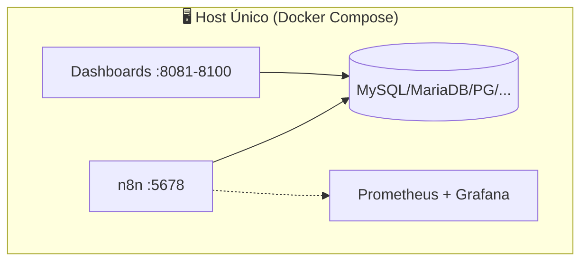
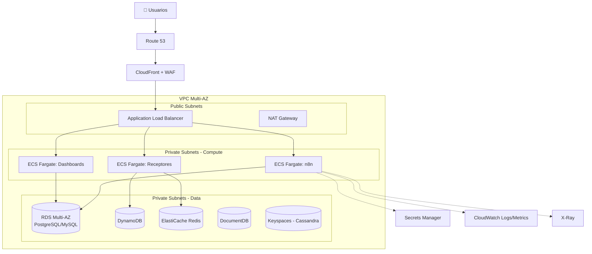
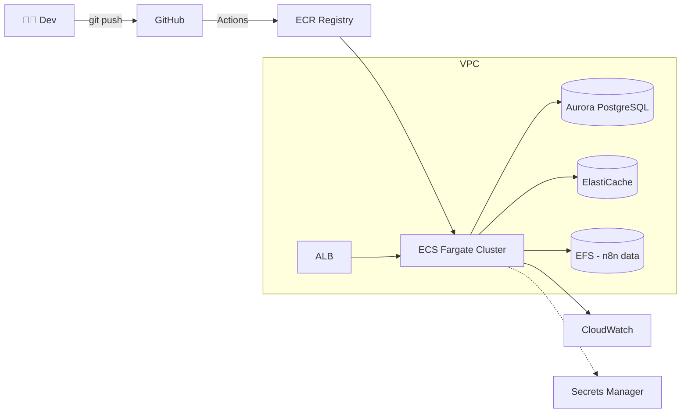
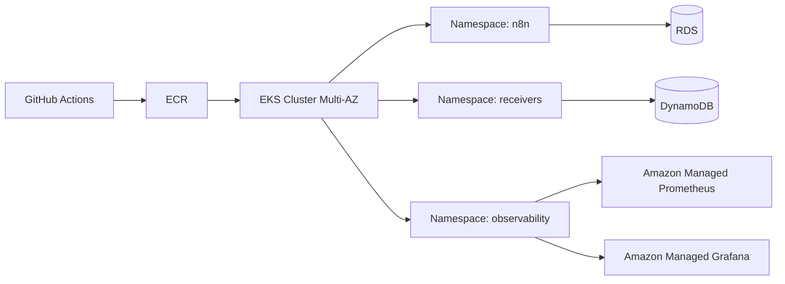
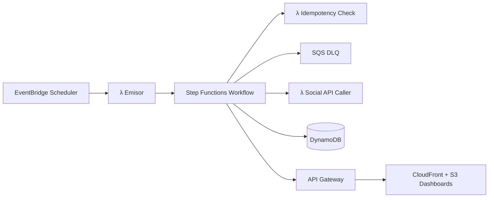
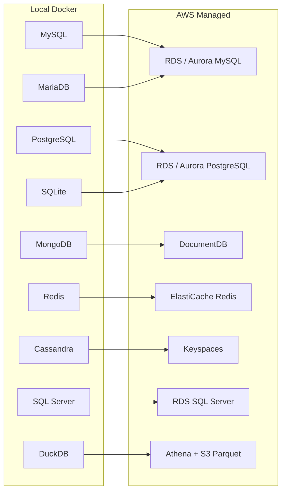
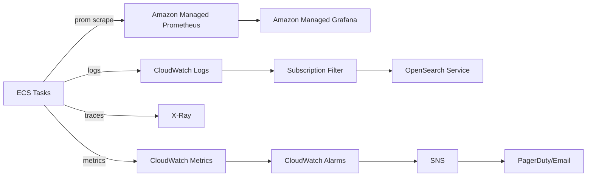

# ☁️ Migración a AWS — Social Bot Scheduler

[](https://aws.amazon.com/)
[](https://www.terraform.io/)
[](https://aws.amazon.com/ecs/)
[](../SECURITY.md)

> [!IMPORTANT]
> Este documento es la **guía maestra** para migrar el laboratorio **Social Bot Scheduler** desde un entorno `localhost` (Docker Compose) hacia **Amazon Web Services**. Cubre arquitectura, servicios candidatos, paso a paso, costos estimados, seguridad y observabilidad.

---

## 📋 Tabla de Contenidos

- [🎯 Objetivos de la Migración](#-objetivos-de-la-migración)
- [🧭 Estado Actual vs. Estado Objetivo](#-estado-actual-vs-estado-objetivo)
- [🏛️ Estrategias de Migración (6 R's)](#️-estrategias-de-migración-6-rs)
- [🧩 Servicios AWS Candidatos](#-servicios-aws-candidatos)
- [🏗️ Arquitecturas de Referencia](#️-arquitecturas-de-referencia)
- [🚦 Comparativa: ECS Fargate vs EKS vs EC2](#-comparativa-ecs-fargate-vs-eks-vs-ec2)
- [💾 Mapeo de Bases de Datos](#-mapeo-de-bases-de-datos)
- [🛠️ Paso a Paso (Hands-on)](#️-paso-a-paso-hands-on)
- [💰 Estimación de Costos](#-estimación-de-costos)
- [🛡️ Seguridad Cloud-Native](#️-seguridad-cloud-native)
- [📊 Observabilidad en AWS](#-observabilidad-en-aws)
- [🔁 CI/CD en AWS](#-cicd-en-aws)
- [🚨 Riesgos y Mitigaciones](#-riesgos-y-mitigaciones)
- [✅ Checklist Final de Cutover](#-checklist-final-de-cutover)
- [📚 Referencias](#-referencias)

---

## 🎯 Objetivos de la Migración

| 🎯 Objetivo | 📌 Descripción |
| :--- | :--- |
| **Disponibilidad** | Pasar de `single-host` a Multi-AZ con SLA ≥ 99.9%. |
| **Escalabilidad** | Auto-scaling horizontal según métricas (CPU, RPS, cola). |
| **Seguridad** | Eliminar binding a `127.0.0.1` y aplicar VPC + IAM + Secrets Manager. |
| **Observabilidad** | Centralizar logs, métricas y trazas con CloudWatch + X-Ray. |
| **Costo** | Pay-per-use con `Spot`, `Savings Plans` y `Graviton` cuando aplique. |
| **Reproducibilidad** | 100% Infrastructure-as-Code (Terraform o AWS CDK). |

---

## 🧭 Estado Actual vs. Estado Objetivo

### 🖥️ Estado Actual (localhost)



### ☁️ Estado Objetivo (AWS Multi-AZ)



---

## 🏛️ Estrategias de Migración (6 R's)

> [!TIP]
> AWS define **seis estrategias** clásicas. Para este laboratorio recomendamos **Replatform** combinado con **Refactor selectivo**.

| Estrategia | Aplicación al Repositorio | Recomendado |
| :--- | :--- | :---: |
| **Rehost** *(Lift & Shift)* | EC2 + Docker Compose tal cual. Mínimo esfuerzo, máximo costo operativo. | ⚠️ |
| **Replatform** *(Lift & Reshape)* | Imágenes a ECR, contenedores a ECS Fargate, DBs a RDS/DocumentDB. | ✅ |
| **Refactor** | Convertir n8n + receptores a Lambda + EventBridge + Step Functions. | 🎯 *(fase 2)* |
| **Repurchase** | Sustituir n8n por **AWS Step Functions** o **Amazon AppFlow**. | ❌ |
| **Retire** | Apagar componentes redundantes (cAdvisor, dashboards duplicados). | ✅ |
| **Retain** | Mantener `localhost` para desarrollo. | ✅ |

---

## 🧩 Servicios AWS Candidatos

### 🚢 Cómputo de Contenedores

| Servicio | Caso de Uso | Trade-off |
| :--- | :--- | :--- |
| **ECS Fargate** | Recomendado para n8n + receptores. Serverless, sin gestión de nodos. | 💵 ~20% más caro que EC2, sin acceso al kernel. |
| **EKS** *(Kubernetes)* | Si el equipo ya domina K8s o requiere CRDs/Operators. | 🧠 Curva de aprendizaje + costo control plane ($72/mes). |
| **EC2 + ECS** | Mayor control, GPU, instancias Spot. | 🛠️ Mantenimiento de AMIs y parches. |
| **AWS Lambda** | Endpoints idempotentes y receptores ligeros (<15 min, <10 GB). | ❄️ Cold starts, no apto para n8n stateful. |
| **App Runner** | Despliegue rápido desde repo Git, ideal para dashboards. | 📉 Menos control de red. |

### 🗄️ Bases de Datos Gestionadas

| Motor Local | Equivalente AWS | Notas |
| :--- | :--- | :--- |
| 🐬 **MySQL** / 🍃 **MariaDB** | **RDS for MySQL** o **Aurora MySQL** | Aurora ofrece 5× rendimiento. |
| 🐘 **PostgreSQL** | **RDS for PostgreSQL** o **Aurora PostgreSQL** | Compatible con n8n. |
| 📂 **SQLite** | **EFS** (archivo) o migrar a **RDS** | SQLite no es cloud-native; preferir RDS. |
| 🍃 **MongoDB** | **Amazon DocumentDB** | API-compatible con MongoDB 5.0. |
| 🏎️ **Redis** | **Amazon ElastiCache for Redis** | Multi-AZ + cluster mode. |
| 👁️ **Cassandra** | **Amazon Keyspaces** | Serverless, API CQL. |
| 🏢 **SQL Server** | **RDS for SQL Server** | Licencia BYOL o License Included. |
| 🦆 **DuckDB** | **Athena + S3 (Parquet)** | Patrón data-lake serverless. |

> [!NOTE]
> A partir de la v4.9.0 la matriz alcanza **18+ motores heterogéneos** (casos 01–20). Los motores incorporados en los casos 10–20 mapean así:

| Motor Local | Equivalente AWS | Notas |
| :--- | :--- | :--- |
| 🧬 **Mnesia** *(embebida BEAM)* | **DynamoDB** o **EFS** | Estado embebido de Erlang/Elixir. |
| 🧠 **pgvector** *(Postgres)* | **RDS/Aurora PostgreSQL + pgvector** | Persistencia vectorial para RAG/IA. |
| 📊 **ClickHouse** | **EC2/EKS self-managed** o **Athena** | OLAP columnar de alto volumen. |
| 🔐 **Supabase** *(Postgres + RLS)* | **RDS PostgreSQL + PostgREST** | BaaS con Row-Level Security. |
| 🪳 **CockroachDB** | **CockroachDB Cloud** o self-managed en EKS | SQL distribuido compatible con Postgres. |
| ⏱️ **TimescaleDB** | **RDS PostgreSQL + extensión** o **Timestream** | Series temporales sobre GraphQL. |
| 📈 **InfluxDB** | **Amazon Timestream** | Métricas IoT/MQTT. |
| 🕸️ **Neo4j** | **Amazon Neptune** | Base de datos de grafos (Cypher). |
| 🔥 **Firestore** *(emulador)* | **DynamoDB** | Documental para mobile-backend. |
| 🕰️ **XTDB** *(caso 19, verificación pendiente)* | **EC2/EKS self-managed** | Bitemporal (funcional puro). |

### 🌐 Red y Edge

| Servicio | Función |
| :--- | :--- |
| **VPC** | Aislamiento de red (subnets públicas/privadas en 2-3 AZs). |
| **ALB** | Balanceo HTTP/HTTPS, path-based routing por caso. |
| **Route 53** | DNS + health checks + failover. |
| **CloudFront** | CDN + caché para dashboards estáticos. |
| **WAF** | Protección OWASP Top 10. |
| **ACM** | Certificados TLS gratuitos. |
| **API Gateway** | Si se exponen webhooks externos con throttling. |

### 🔐 Seguridad e Identidad

| Servicio | Uso |
| :--- | :--- |
| **IAM** | Roles por tarea ECS (Task Role + Execution Role). |
| **Secrets Manager** | Reemplaza `.env`. Rotación automática. |
| **Parameter Store** | Configuración no sensible. |
| **KMS** | Cifrado at-rest en RDS/S3/EBS. |
| **GuardDuty** | Detección de amenazas. |
| **Inspector** | Escaneo de imágenes en ECR (sustituye Trivy en CI). |
| **Security Hub** | Consolidación CIS / PCI-DSS. |

### 📦 Almacenamiento

| Servicio | Uso |
| :--- | :--- |
| **S3** | Backups de DB, artefactos, posts.json, logs archivados. |
| **EFS** | Volumen compartido para n8n (workflows persistentes). |
| **EBS** | Solo si se usa EC2. |
| **ECR** | Registro privado de imágenes Docker. |

### 📊 Observabilidad

| Servicio | Reemplaza |
| :--- | :--- |
| **CloudWatch Logs** | `docker logs` |
| **CloudWatch Metrics** | Prometheus |
| **CloudWatch Dashboards** | Grafana (o usar **Amazon Managed Grafana**) |
| **AWS X-Ray** | Trazas distribuidas |
| **Amazon Managed Prometheus (AMP)** | Compatible con scrape configs existentes |

---

## 🏗️ Arquitecturas de Referencia

### 🥇 Opción A — Replatform con ECS Fargate *(Recomendada)*



**Ventajas:** sin gestión de nodos, escalado por servicio, costo predecible.

---

### 🥈 Opción B — EKS para entornos K8s-native



**Ideal cuando:** se requieren Helm charts, Operators, o políticas avanzadas (Istio, Argo CD).

---

### 🥉 Opción C — Serverless (Refactor agresivo)



**Ideal para:** cargas burst, costos cercanos a cero en idle. Requiere reescribir n8n.

---

## 🚦 Comparativa: ECS Fargate vs EKS vs EC2

| Criterio | ECS Fargate | EKS | EC2 + Docker |
| :--- | :---: | :---: | :---: |
| ⏱️ **Time-to-prod** | 🟢 Días | 🟡 Semanas | 🟡 Semanas |
| 💰 **Costo control plane** | 🟢 $0 | 🔴 $72/mes | 🟢 $0 |
| 🧠 **Curva de aprendizaje** | 🟢 Baja | 🔴 Alta | 🟡 Media |
| 🔧 **Flexibilidad** | 🟡 Media | 🟢 Alta | 🟢 Alta |
| 🛡️ **Aislamiento** | 🟢 Por tarea | 🟢 Por pod | 🟡 Compartido |
| 📈 **Auto-scaling** | 🟢 Nativo | 🟢 HPA/Cluster Autoscaler | 🟡 ASG manual |
| 🩹 **Parches OS** | 🟢 AWS los gestiona | 🟡 Worker nodes | 🔴 Tu responsabilidad |

> [!NOTE]
> **Recomendación oficial:** comienza con **ECS Fargate** y migra a EKS solo si aparece una necesidad real (multi-cloud, CRDs, Service Mesh).

---

## 💾 Mapeo de Bases de Datos



### 🔄 Estrategias de Carga Inicial

| Origen | Herramienta AWS | Modo |
| :--- | :--- | :--- |
| MySQL/PostgreSQL | **AWS DMS** | Full + CDC continuo |
| MongoDB → DocumentDB | **mongodump / mongorestore** | Snapshot offline |
| Redis | **ElastiCache import RDB** | Restore desde S3 |
| Cassandra → Keyspaces | **DSBulk** | Batch CSV |
| SQLite | **Script Python** | One-shot ETL |

---

## 🛠️ Paso a Paso (Hands-on)

> [!IMPORTANT]
> Esta guía asume **AWS CLI v2**, **Terraform ≥ 1.6** y permisos de administrador en una cuenta sandbox.

### 🧱 Fase 0 — Preparación (Día 0)

```bash
# 1. Configurar credenciales
aws configure --profile sbs-prod

# 2. Crear bucket de estado de Terraform
aws s3 mb s3://sbs-terraform-state --region us-east-1
aws s3api put-bucket-versioning \
  --bucket sbs-terraform-state \
  --versioning-configuration Status=Enabled

# 3. Crear tabla DynamoDB para locking
aws dynamodb create-table \
  --table-name sbs-tf-lock \
  --attribute-definitions AttributeName=LockID,AttributeType=S \
  --key-schema AttributeName=LockID,KeyType=HASH \
  --billing-mode PAY_PER_REQUEST
```

### 🌐 Fase 1 — Red (VPC, Subnets, NAT)

```hcl
# infra/vpc.tf
module "vpc" {
  source  = "terraform-aws-modules/vpc/aws"
  version = "~> 5.5"

  name = "sbs-vpc"
  cidr = "10.20.0.0/16"

  azs             = ["us-east-1a", "us-east-1b", "us-east-1c"]
  public_subnets  = ["10.20.1.0/24", "10.20.2.0/24", "10.20.3.0/24"]
  private_subnets = ["10.20.10.0/24", "10.20.20.0/24", "10.20.30.0/24"]

  enable_nat_gateway     = true
  single_nat_gateway     = false   # Multi-AZ NAT
  enable_dns_hostnames   = true
  enable_flow_log        = true
}
```

### 📦 Fase 2 — Registro de Imágenes (ECR)

```bash
# Crear un repo por servicio
for svc in n8n case01-emisor case01-receptor case02-emisor ...; do
  aws ecr create-repository --repository-name sbs/$svc \
    --image-scanning-configuration scanOnPush=true \
    --encryption-configuration encryptionType=KMS
done

# Login + build + push
aws ecr get-login-password | docker login --username AWS \
  --password-stdin <account>.dkr.ecr.us-east-1.amazonaws.com

docker build -t sbs/case01-emisor cases/case01/emisor/
docker tag  sbs/case01-emisor <account>.dkr.ecr.us-east-1.amazonaws.com/sbs/case01-emisor:v4.9.0
docker push <account>.dkr.ecr.us-east-1.amazonaws.com/sbs/case01-emisor:v4.9.0
```

### 🗄️ Fase 3 — Bases de Datos

```hcl
resource "aws_rds_cluster" "aurora_pg" {
  cluster_identifier      = "sbs-aurora-pg"
  engine                  = "aurora-postgresql"
  engine_version          = "15.5"
  database_name           = "n8n"
  master_username         = "sbs_admin"
  master_password         = random_password.db.result
  storage_encrypted       = true
  kms_key_id              = aws_kms_key.rds.arn
  backup_retention_period = 14
  deletion_protection     = true
  vpc_security_group_ids  = [aws_security_group.rds.id]
  db_subnet_group_name    = aws_db_subnet_group.private.name
}
```

### 🚢 Fase 4 — Cluster ECS Fargate

```hcl
resource "aws_ecs_cluster" "main" {
  name = "sbs-cluster"
  setting {
    name  = "containerInsights"
    value = "enabled"
  }
}

resource "aws_ecs_task_definition" "n8n" {
  family                   = "sbs-n8n"
  requires_compatibilities = ["FARGATE"]
  network_mode             = "awsvpc"
  cpu                      = 1024
  memory                   = 2048
  execution_role_arn       = aws_iam_role.ecs_exec.arn
  task_role_arn            = aws_iam_role.n8n_task.arn

  container_definitions = jsonencode([{
    name  = "n8n"
    image = "${aws_ecr_repository.n8n.repository_url}:v4.9.0"
    portMappings = [{ containerPort = 5678 }]
    secrets = [
      { name = "DB_POSTGRESDB_PASSWORD",
        valueFrom = aws_secretsmanager_secret.n8n_db.arn }
    ]
    logConfiguration = {
      logDriver = "awslogs"
      options = {
        "awslogs-group"         = "/ecs/sbs-n8n"
        "awslogs-region"        = "us-east-1"
        "awslogs-stream-prefix" = "n8n"
      }
    }
  }])
}
```

### 🔐 Fase 5 — Secretos y Configuración

```bash
aws secretsmanager create-secret \
  --name sbs/n8n/db \
  --secret-string '{"username":"sbs_admin","password":"***"}' \
  --kms-key-id alias/sbs-secrets

aws secretsmanager create-secret \
  --name sbs/social/twitter-api \
  --secret-string '{"bearer_token":"***"}'
```

### 🌍 Fase 6 — Exposición Pública

1. Crear **ACM cert** en `us-east-1` para `*.sbs.example.com`.
2. Aprovisionar **ALB** con listeners 80→443 redirect y 443 con cert.
3. Configurar **Target Groups** por servicio (n8n/5678, dashboards/8081-8100).
4. Crear **Route 53 A-Alias** apuntando al ALB.
5. (Opcional) **CloudFront** + **WAF** delante del ALB para los dashboards estáticos.

### 🔄 Fase 7 — Migración de Datos

```bash
# Ejemplo: PostgreSQL local → Aurora
pg_dump -h localhost -U sbs sbs_db | \
  psql -h sbs-aurora-pg.cluster-xxx.us-east-1.rds.amazonaws.com -U sbs_admin sbs_db

# Validación
python verify_n8n.py --remote https://n8n.sbs.example.com
```

### 🚀 Fase 8 — Cutover

1. Activar **modo lectura** en el entorno local.
2. DMS: pasar a **CDC final + apply pending**.
3. Cambiar **Route 53** a los endpoints AWS.
4. Monitorear CloudWatch durante 24h.
5. Apagar Docker Compose local.

---

## 💰 Estimación de Costos

> [!WARNING]
> Cifras orientativas en **USD**, región `us-east-1`, basadas en tarifas públicas a la fecha del documento. Usa siempre la [AWS Pricing Calculator](https://calculator.aws) para tu caso real.

### 🧪 Escenario A — Lab/Dev *(bajo tráfico, single-AZ)*

| Componente | Configuración | Costo Mensual |
| :--- | :--- | ---: |
| ECS Fargate | 4 tasks × 0.25 vCPU × 0.5 GB × 730 h | **~$15** |
| Aurora Serverless v2 (PG) | 0.5 ACU promedio | **~$45** |
| ElastiCache Redis | `cache.t4g.micro` × 1 | **~$12** |
| ALB | 1 unidad + bajo tráfico | **~$18** |
| NAT Gateway | 1 unidad | **~$33** |
| CloudWatch Logs | 5 GB ingest | **~$3** |
| ECR | 10 GB storage | **~$1** |
| Secrets Manager | 5 secretos | **~$2** |
| Route 53 | 1 zona | **~$0.5** |
| Data Transfer | 10 GB out | **~$1** |
| **TOTAL** | | **≈ $130/mes** |

### 🏭 Escenario B — Producción Multi-AZ *(carga media)*

| Componente | Configuración | Costo Mensual |
| :--- | :--- | ---: |
| ECS Fargate | 12 tasks × 0.5 vCPU × 1 GB × 730 h | **~$90** |
| Aurora PostgreSQL | `db.r6g.large` × 2 nodos | **~$420** |
| DocumentDB | `db.t4g.medium` × 2 | **~$200** |
| ElastiCache Redis | `cache.r7g.large` × 2 (cluster) | **~$240** |
| ALB | + 50M requests | **~$45** |
| NAT Gateway | 3 AZs | **~$100** |
| CloudFront + WAF | 200 GB + 50M req | **~$50** |
| CloudWatch | 50 GB logs + métricas | **~$45** |
| Backups + S3 | 100 GB | **~$10** |
| Data Transfer | 200 GB out | **~$18** |
| **TOTAL** | | **≈ $1,200/mes** |

### 💸 Optimizaciones Recomendadas

| Técnica | Ahorro Estimado |
| :--- | :--- |
| **Compute Savings Plans** (1 año) | hasta **30%** |
| **Graviton (ARM)** en Fargate/RDS | hasta **20%** |
| **Aurora Serverless v2** en dev | hasta **70%** vs provisionado |
| **S3 Intelligent-Tiering** | hasta **40%** en backups |
| **VPC Endpoints** (S3, ECR, SecretsMgr) | reduce tráfico NAT |
| **Single NAT Gateway** en dev | **~$66/mes** menos |

---

## 🛡️ Seguridad Cloud-Native

> [!IMPORTANT]
> La política **"🛡️ Security: Hardened"** del repositorio se preserva y se amplía en AWS con controles adicionales.

### 🔒 Controles Mínimos Obligatorios

| Capa | Control |
| :--- | :--- |
| **Identidad** | IAM roles por tarea + MFA + SCP a nivel Organization. |
| **Red** | SGs least-privilege, NACLs por subnet, **VPC Flow Logs** a S3. |
| **Cifrado** | KMS CMK propias en RDS, S3, EBS, EFS, Secrets. |
| **Secretos** | Secrets Manager con **rotación de 30 días**. |
| **Imágenes** | ECR scan-on-push + **Inspector v2**. |
| **WAF** | Reglas AWS Managed: Core, Bad Inputs, Anonymous IP. |
| **DDoS** | Shield Standard (gratis) + Shield Advanced en producción crítica. |
| **Auditoría** | CloudTrail org-wide + Config + GuardDuty. |
| **Compliance** | Security Hub con CIS AWS 1.5 + PCI-DSS si aplica. |

### 🚫 Anti-patrones a Evitar

- ❌ **Credenciales hardcoded** en task definitions (usar Secrets Manager).
- ❌ **Security Group** abierto `0.0.0.0/0` excepto ALB:443.
- ❌ **RDS público**: siempre en subnets privadas.
- ❌ **Bucket S3 público** sin Block Public Access.
- ❌ **Tareas Fargate** con `--privileged` o sin `read-only root fs`.

---

## 📊 Observabilidad en AWS



### 🎯 Métricas Clave (SLI)

| SLI | Umbral | Servicio |
| :--- | :--- | :--- |
| **n8n latency P95** | < 500 ms | CloudWatch |
| **Webhook error rate** | < 0.5% | CloudWatch |
| **DB CPU** | < 70% | RDS Performance Insights |
| **DLQ depth** | = 0 | SQS Metric |
| **Container OOM** | = 0 | Container Insights |

---

## 🔁 CI/CD en AWS

### 🔧 Pipeline GitHub Actions → ECS

```yaml
# .github/workflows/deploy-aws.yml
name: Deploy to AWS
on:
  push:
    branches: [main]
jobs:
  deploy:
    runs-on: ubuntu-latest
    permissions:
      id-token: write   # OIDC
      contents: read
    steps:
      - uses: actions/checkout@v4
      - uses: aws-actions/configure-aws-credentials@v4
        with:
          role-to-assume: arn:aws:iam::<acct>:role/gha-deploy
          aws-region: us-east-1
      - uses: aws-actions/amazon-ecr-login@v2
      - name: Build & Push
        run: |
          docker build -t $ECR/sbs/n8n:${{ github.sha }} .
          docker push   $ECR/sbs/n8n:${{ github.sha }}
      - uses: aws-actions/amazon-ecs-render-task-definition@v1
        with:
          task-definition: infra/ecs/n8n.json
          container-name: n8n
          image: $ECR/sbs/n8n:${{ github.sha }}
      - uses: aws-actions/amazon-ecs-deploy-task-definition@v2
        with:
          service: sbs-n8n
          cluster: sbs-cluster
          wait-for-service-stability: true
```

### 🌀 Alternativa Nativa

**CodePipeline** + **CodeBuild** + **CodeDeploy (Blue/Green)** elimina dependencia de GitHub Actions y reduce permisos cruzados.

---

## 🚨 Riesgos y Mitigaciones

| 🔥 Riesgo | 🛡️ Mitigación |
| :--- | :--- |
| **Sobrecosto inicial** | Budget Alerts + Cost Anomaly Detection + tag policies. |
| **Lock-in con servicios propietarios** | Mantener compatibilidad PostgreSQL/Redis estándar; contenedores portables. |
| **Latencia n8n por cold-start de Fargate** | Mantener `desiredCount ≥ 1` y usar `minimumHealthyPercent=100`. |
| **Pérdida de datos en migración** | DMS con CDC + dump previo en S3 + ventana de read-only. |
| **Fugas de secretos** | Rotación automática + IAM `secretsmanager:GetSecretValue` por tarea. |
| **DDoS** | Shield + WAF + CloudFront. |
| **Deriva de IaC** | `terraform plan` en CI + drift detection con AWS Config. |

---

## ✅ Checklist Final de Cutover

- [ ] VPC, subnets y NAT desplegados en 3 AZs.
- [ ] ECR poblado con todas las imágenes versionadas.
- [ ] RDS Aurora Multi-AZ con backups automáticos verificados.
- [ ] Secretos en Secrets Manager con rotación activa.
- [ ] ECS services con auto-scaling y health checks.
- [ ] ALB + ACM + Route 53 funcionando.
- [ ] WAF y GuardDuty activos.
- [ ] CloudWatch dashboards y alarmas críticas configuradas.
- [ ] Pipeline CI/CD con OIDC desplegando exitosamente.
- [ ] Runbook de Disaster Recovery probado (RTO < 1h, RPO < 15min).
- [ ] Smoke tests `verify_n8n.py` y `verify_all_cases.py` en verde contra entorno cloud.
- [ ] Apagado controlado del entorno `localhost`.

---

## 📚 Referencias

| Recurso | URL |
| :--- | :--- |
| AWS Well-Architected Framework | https://aws.amazon.com/architecture/well-architected/ |
| AWS Pricing Calculator | https://calculator.aws |
| ECS Best Practices Guide | https://docs.aws.amazon.com/AmazonECS/latest/bestpracticesguide/ |
| Terraform AWS Modules | https://registry.terraform.io/namespaces/terraform-aws-modules |
| AWS Prescriptive Guidance — Migrations | https://aws.amazon.com/prescriptive-guidance/ |
| n8n on AWS — Reference | https://docs.n8n.io/hosting/installation/server-setups/aws/ |

---

### 🔗 Documentos Relacionados

| Tipo | Documento |
| :--- | :--- |
| 🏗️ **Arquitectura local** | [docs/ARCHITECTURE.md](ARCHITECTURE.md) |
| 🛡️ **Seguridad** | [SECURITY.md](../SECURITY.md) \| [docs/RUNTIME_SECURITY.md](RUNTIME_SECURITY.md) |
| 🎓 **Instalación local** | [docs/INSTALL.md](INSTALL.md) |
| 🛣️ **Roadmap** | [ROADMAP.md](../ROADMAP.md) |

---

*Coded with ❤️ by Vladimir Acuña — Cloud Edition*
